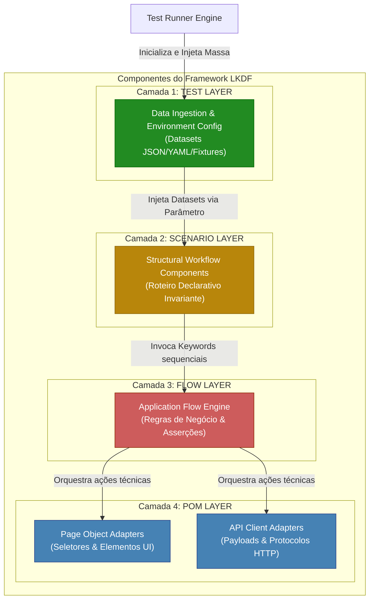

# Layered Keyword-Driven Framework (LKDF)

[](https://blog.cleancoder.com/uncle-bob/2012/08/13/the-clean-architecture.html)
[]()
[]()
[]()
[]()
[]()
[]()
[]()
[](LICENSE)

---

## Repository Activity

[]()
[]()
[]()
[]()

O **LKDF (Layered Keyword-Driven Framework)** é uma arquitetura de referência para automação de testes corporativos (*Enterprise*). Ele foi projetado para resolver a crise de manutenção e o crescimento descontrolado de código de teste em projetos de larga escala.

Ao fundir os princípios clássicos da **Clean Architecture** com os padrões de teste mais robustos do mercado (*Page Object Model*, *Keyword-Driven* e *Data-Driven*), o LKDF estabelece uma separação física rigorosa de conceitos através de quatro camadas estritas e unidirecionais. O resultado é uma suíte de testes resiliente, livre de *flakiness* e com crescimento de complexidade assintoticamente linear $O(N)$.

---

## 1.0 Visão Geral da Arquitetura

Diferente das abordagens tradicionais onde dados, regras de negócio e seletores técnicos de tela coabitam o mesmo arquivo, o LKDF organiza o sistema de testes em quatro domínios concêntricos. 

A regra fundamental e absoluta do framework é a **Regra de Dependência Unidirecional Descendente**: as dependências de código (instanciações e imports) apontam apenas para baixo. Nenhuma camada conhece a existência do nível superior ou pode realizar *bypass* (pular) de níveis intermediários.



### 1.1 O Modelo Mental das Camadas

* **`TEST` = Variação:** Provedor da informação. Gerencia e injeta a massa de dados dinâmicos e imutáveis em tempo de execução (*Data-Driven*). **Custo de código novo: $O(0)$.**
* **`SCENARIO` = Estrutura:** O esqueleto gramatical. Define a ordem cronológica e declarativa da jornada do usuário através de palavras-chave, sem conter lógica ou dados fixos.
* **`FLOW` = Lógica:** O cérebro da automação. Processa as regras de negócio do produto, gerencia tomadas de decisão algorítmicas e abriga as asserções funcionais (*business assertions*).
* **`POM` = Execução Técnica:** O operário de infraestrutura. Isola a mecânica de interação física com o sistema sob teste (SUT), seja via Web (HTML DOM), API (REST/gRPC) ou Banco de Dados (SQL).

---

## 2.0 Matriz de Responsabilidades

Para garantir a integridade do design durante revisões de código (*Code Reviews*), cada componente deve seguir estritamente o contrato abaixo:

| Camada | Responsabilidade Única | Gatilho Admissível de Mudança | O que NÃO pode conter (Restrição Rígida) |
| --- | --- | --- | --- |
| **TEST** | Parametrizar a execução da suíte. | Inclusão de novas massas de dados ou chaves de ambiente. | Estruturas de controle (`if/else`), laços, asserções ou seletores técnicos. |
| **SCENARIO** | Orquestrar a jornada macro do usuário. | Alteração no fluxo e processo macro de uso da aplicação. | Dados fixos (*hardcoded*), asserções funcionais ou tratamento de exceções. |
| **FLOW** | Processar lógica de negócio e asserções. | Mudança em regras corporativas, cálculos ou critérios de aceitação. | Seletores de tela (XPath/CSS), URLs base ou inicialização de drivers. |
| **POM** | Abstrair e isolar o ecossistema técnico. | Refatoração de layout do SUT, mudança de IDs, schemas ou rotas de API. | Lógica de negócio cruzada, validações corporativas ou tomada de decisão. |

---

## 3.0 Exemplo Prático de Implementação (Python)

Abaixo está a representação de um sistema de Login mapeado segundo os padrões arquiteturais do LKDF:

### 1. POM Layer (`src/pom/login_page.py`)

```python
class LoginPagePOM:
    def __init__(self, driver):
        self.driver = driver
        self.username_field = "css=input[name='username']"
        self.password_field = "css=input[name='password']"
        self.submit_button  = "id=btn-login"

    def preencher_campo_usuario(self, usuario: str):
        self.driver.clear_and_type(self.username_field, usuario)

    def preencher_campo_senha(self, senha: str):
        self.driver.clear_and_type(self.password_field, senha)

    def disparar_clique_autenticacao(self):
        self.driver.click(self.submit_button)

```

### 2. Flow Layer (`src/flows/login_flow.py`)

```python
class LoginFlow:
    def __init__(self, login_pom):
        self.login_pom = login_pom

    def executar_fluxo_autenticacao(self, usuario: str, senha: str):
        self.login_pom.preencher_campo_usuario(usuario)
        self.login_pom.preencher_campo_senha(senha)
        self.login_pom.disparar_clique_autenticacao()

```

### 3. Scenario Layer (`src/scenarios/autenticacao_scenario.py`)

```python
class AutenticacaoScenario:
    def __init__(self, login_flow):
        self.login_flow = login_flow

    def login_standard_flow(self, dataset: dict):
        self.login_flow.executar_fluxo_autenticacao(
            usuario=dataset["username_input"],
            senha=dataset["password_input"]
        )

```

### 4. Test Layer (`tests/test_login.py`)

```python
def test_autenticacao_sucesso_corporativo(driver_instance):
    # Ingestão de Dados Imutável
    dataset_sucesso = {
        "username_input": "user.enterprise@company.com",
        "password_input": "SenhaSegura123!"
    }
    
    # Resolução de dependências acíclica descendente
    pom_layer      = LoginPagePOM(driver_instance)
    flow_layer     = LoginFlow(pom_layer)
    scenario_layer = AutenticacaoScenario(flow_layer)
    
    # Execução
    scenario_layer.login_standard_flow(dataset_sucesso)
    assert driver_instance.get_current_url() == "[https://company.com/dashboard](https://company.com/dashboard)"

```

---
## 4.0 Architectural Constraints & Enforcement Rules (Governança e Restrições)

O LKDF deixa de ser apenas um guia de boas práticas e se torna um **framework de engenharia impositivo (*enforceable*)** através da aplicação de restrições arquiteturais automatizadas. Para evitar a erosão do código sob pressão de prazos, as seguintes regras são absolutas e auditadas via pipeline de CI/CD:

```text
       [ TEST ] ──────────────┐
          │ (Permitido)       │
          ▼                   │
      [ SCENARIO ]            │
          │ (Permitido)       │ PROIBIDO (Bypass de Camada)
          ▼                   │
       [ FLOW ]               │
          │ (Permitido)       │
          ▼                   │
       [ POM ] ◄──────────────┘

```

### 4.1 As Quatro Proibições Absolutas:

1. **Nenhuma camada pode importar ou conhecer uma camada superior:** O fluxo de acoplamento é estritamente descendente (`TEST` $\rightarrow$ `SCENARIO` $\rightarrow$ `FLOW` $\rightarrow$ `POM`). Um `import` em sentido inverso quebra a previsibilidade e causa rejeição automática no Code Review.
2. **A camada `SCENARIO` está terminantemente proibida de chamar a camada `POM`:** Cenários gerenciam a gramática macro do negócio. Eles não podem realizar *bypass* (pular) a camada inteligente de `FLOW` para tocar em seletores ou execuções técnicas diretamente.
3. **A camada `FLOW` não pode acessar o driver de automação ou primitivas de rede:** O fluxo processa lógica e asserções funcionais sobre parâmetros puramente abstratos. O acesso físico ao navegador (Playwright/Selenium), requisições HTTP ou conexões SQL é monopólio exclusivo do `POM`.
4. **A camada `TEST` não pode conter estruturas de decisão algorítmica ou asserções corporativas:** Arquivos de teste servem unicamente como injetores de massa de dados imutáveis (*Data Providers*). Condicionais (`if/else`), laços de repetição personalizados ou validações de negócio não pertencem a este nível.

### 4.2 Mecanismo de Imposição Automatizada (Guardrails no CI/CD)

Para garantir que estas regras sejam respeitadas sem depender da análise humana, o framework utiliza análise estática de dependências via `import-linter`. O arquivo de configuração `.importlinter` na raiz do projeto bloqueia fisicamente desvios arquiteturais:

```ini
[importlinter]
root_package = src

[contracts]
name = LKDF Strict Layered Architecture
type = layers
layers =
    src.tests
    src.scenarios
    src.flows
    src.pom
containers =
    src

```

*Se qualquer desenvolvedor violar uma das regras (ex: importar um POM dentro de um Scenario), o comando `lint-imports` falhará no pipeline, bloqueando o Merge do Pull Request.*

---

## 5.0 Runtime Execution Model (O Motor de Execução do Sistema)

Para compreender como o LKDF se comporta na prática, é preciso entender a mecânica da **Engine Mental de Execução**. O framework opera dividindo o ciclo de vida do teste em duas fases distintas na memória: a **Fase de Carga (Data Binding)** e a **Fase de Impacto (Execution Pipeline)**.

### 5.1 O Ciclo de Vida em 5 Etapas Detalhadas:

1. **Memory Allocation & Data Ingestion (Fase TEST):**
O Test Runner (ex: Pytest) inicia a execução e aloca em memória a matriz de dados declarada (dicionários, JSON, etc.). Nenhuma inteligência técnica foi disparada ainda. O dado está isolado no topo.
2. **Structural Handshake (Fase SCENARIO):**
O teste invoca a jornada correspondente na camada `SCENARIO`, passando o dataset completo por referência. O cenário funciona como um canal de passagem limpo (*pass-through*): ele recebe o pacote fechado, lê o roteiro imutável de passos e distribui as variáveis para os métodos da camada inferior.
3. **Algorithmic Processing & Assertion Prep (Fase FLOW):**
A camada `FLOW` intercepta os parâmetros fortemente tipados enviados pelo cenário. Aqui, a engine de lógica é ativada. O fluxo calcula regras de elegibilidade, resolve caminhos condicionais e prepara as asserções de engenharia que validarão o sucesso ou falha do negócio.
4. **Imperative Translation (Fase POM):**
O `FLOW` aciona as funções atômicas da camada `POM`. O objeto de página atua como um tradutor técnico "burro": ele pega os dados puros já processados e os converte em comandos de baixo nível compreensíveis pelo Driver de automação (cliques, preenchimentos, digitação).
5. **Physical Subsystem Impact (Fase SUT):**
Os comandos físicos batem contra a aplicação real (interface gráfica, endpoints de API ou tabelas de banco). O sistema sob teste (SUT) reage, e a resposta bruta faz o caminho inverso pelo barramento para que as asserções preparadas na etapa 3 validem o comportamento final.
---

## 6.0 Governança e Guardrails de Código (CI/CD)

A sustentabilidade do LKDF é garantida por barreiras automatizadas. Para evitar a erosão arquitetural (como desenvolvedores colocando lógicas de negócio no POM ou pulando camadas), este repositório utiliza o `import-linter` integrado ao pipeline de CI/CD.

Para rodar o validador de arquitetura localmente:

```bash
pip install import-linter
lint-imports

```

Se um arquivo violar a árvore de dependências estrutural, o pipeline falhará de forma automática, impedindo o merge do *Pull Request*.

---

## 7.0 Benefícios e ROI do Projeto

* **Centralização Total de Manutenções:** Alterações visuais alteram apenas a camada `POM` ($O(1)$). Alterações de regras de produto alteram apenas a camada `FLOW`.
* **Escalabilidade Linear:** Evita o crescimento exponencial de scripts tradicionais. O esforço acumulado de código é mantido sob controle linear e previsível.
* **Reuso Massivo:** Palavras-chave estruturadas no `FLOW` funcionam como blocos de montar (Lego) globais, servindo a dezenas de cenários de teste distintos.
* **Segurança de Investimento:** A camada de negócio é 100% agnóstica à tecnologia. Se a empresa decidir migrar a engine base de automação (ex: de Selenium para Playwright), **as camadas TEST, SCENARIO e FLOW permanecem intactas**, exigindo alteração técnica exclusiva dentro da camada POM.

---

## 8.0 Documentação Completa

Para compreender os fundamentos teóricos (ISO 29148, ISO 25010), análises assintóticas matemáticas Big-O e casos complexos de uso, consulte o nosso **[WHITEPAPER.md](WHITEPAPER.md)** oficial disponível na raiz deste repositório.

---
## 👤 Author

**Eduardo Felizardo Cândido**  
Senior QA Automation Engineer | Software Architecture in Test Systems  
LKDF Framework Designer

---
