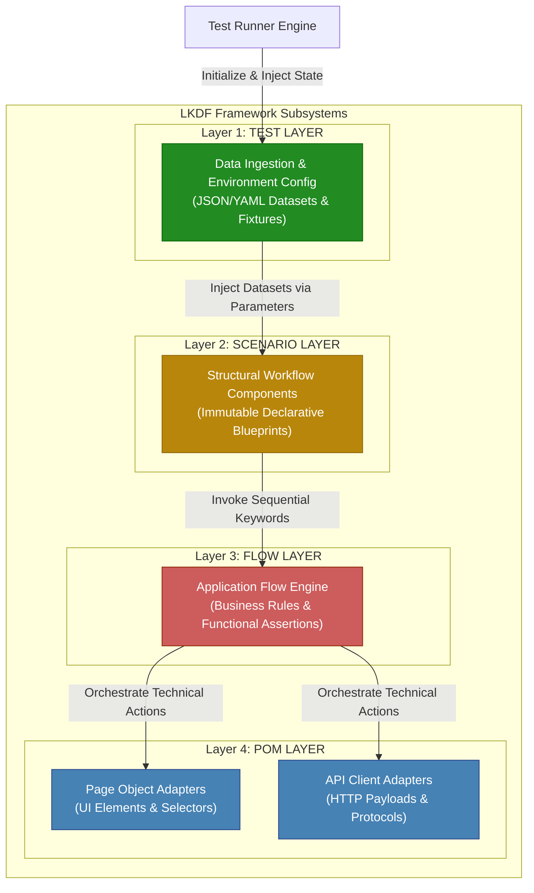

# Layered Keyword-Driven Framework (LKDF)

[](https://blog.cleancoder.com/uncle-bob/2012/08/13/the-clean-architecture.html)
[]()
[]()
[]()
[]()
[]()
[]()
[]()
[](LICENSE)

---

## Repository Activity

[]()
[]()
[]()
[]()

The **Layered Keyword-Driven Framework (LKDF)** is an enterprise-grade reference architecture for test automation designed to overcome the maintenance crises and uncontrolled code bloat common in large-scale test suites.

By fusing classical **Clean Architecture** core tenets with the industry's most resilient testing patterns (**Page Object Model**, **Keyword-Driven**, and **Data-Driven Testing**), LKDF establishes a strict, physical separation of concerns across four decoupled, unidirectional layers. The ultimate payoff is a highly reliable test suite, entirely free of flakiness, featuring an asymptotically linear growth complexity of $O(N)$.

---

## 1.0 Architectural Overview

Unlike traditional, tightly coupled approaches where test data, business logic, and UI selectors share the same physical file, LKDF organizes the automation system into four concentric domains. 

The structural backbone of the framework is governed by the **Strict Downward Unidirectional Dependency Rule**: code dependencies (`imports`, instantiations, and method calls) flow exclusively down the stack. No layer possesses runtime visibility or knowledge of higher levels, and bypassing intermediate layers is strictly forbidden.



### The Layered Mental Model

* **`TEST` = Variance:** The data provider. It manages and injects immutable dynamic datasets at runtime (*Data-Driven*). **Engineering cost for new test permutations: $O(0)$.**
* **`SCENARIO` = Structure:** The grammatical blueprint. It maps out the chronological, declarative flow of the user journey using abstract keywords, completely stripped of logical routing or raw values.
* **`FLOW` = Logic:** The automation brain. It evaluates business rules, handles algorithmic decisions, manages conditional switching, and executes functional domain assertions.
* **`POM` = Technical Execution:** The infrastructure worker. It completely isolates the low-level mechanics of physically interacting with the System Under Test (SUT) across UI (DOM), API (REST/gRPC), or Database (SQL) protocols.

---

## 2.0 Responsibility Assignment Matrix

To maintain design integrity during peer Code Reviews, every code change must match the following matrix constraints exactly:

| Layer | Single Responsibility | Admissible Change Trigger | Architectural Restrictions (Strictly Forbidden) |
| --- | --- | --- | --- |
| **TEST** | Parameterize test execution variants. | Appending data variations, new profiles, or environment keys. | Control flow statements (`if/else`), loops, business assertions, or technical selectors. |
| **SCENARIO** | Orchestrate the macro-level user journey. | Modifications to the system's macro user experience workflows. | Hardcoded data, functional validation assertions, or exception handling. |
| **FLOW** | Process domain logic and assertions. | Evolving business logic, calculations, or functional criteria. | UI selectors (XPath/CSS), raw URLs, or direct interaction with driver engines. |
| **POM** | Abstract and isolate technical infrastructure. | UI layout refactoring, altered IDs, schema shifts, or API contract changes. | Cross-cutting business rules, corporate domain validations, or logical routing. |

---

## 3.0 Practical Implementation Example (Python)

Below is an authentication system implementation displaying how data binds and flows through the four decoupled layers of the LKDF:

### 1. POM Layer (`src/pom/login_page.py`)

```python
class LoginPagePOM:
    """
    Responsibility: Encapsulate infrastructure interactions and low-level selectors.
    Constraints: Zero business logic, zero assertions. Pure technical execution.
    """
    def __init__(self, driver):
        self.driver = driver
        self.username_field = "css=input[name='username']"
        self.password_field = "css=input[name='password']"
        self.submit_button  = "id=btn-login"

    def fill_username_field(self, username: str):
        self.driver.clear_and_type(self.username_field, username)

    def fill_password_field(self, password: str):
        self.driver.clear_and_type(self.password_field, password)

    def trigger_authentication_click(self):
        self.driver.click(self.submit_button)

```

### 2. Flow Layer (`src/flows/login_flow.py`)

```python
class LoginFlow:
    """
    Responsibility: Orchestrate atomic POM actions to execute business workflows.
    Constraints: Highly logical, completely agnostic of datasets, selectors, or drivers.
    """
    def __init__(self, login_pom: LoginPagePOM):
        self.login_pom = login_pom

    def execute_authentication_flow(self, username: str, password: str):
        self.login_pom.fill_username_field(username)
        self.login_pom.fill_password_field(password)
        self.login_pom.trigger_authentication_click()

```

### 3. Scenario Layer (`src/scenarios/authentication_scenario.py`)

```python
class AuthenticationScenario:
    """
    Responsibility: Define structural, immutable journey blueprints.
    Constraints: Zero code logic, zero hardcoded values. Pass-through interface only.
    """
    def __init__(self, login_flow: LoginFlow):
        self.login_flow = login_flow

    def login_standard_flow(self, dataset: dict):
        self.login_flow.execute_authentication_flow(
            username=dataset["username_input"],
            password=dataset["password_input"]
        )

```

### 4. Test Layer (`tests/test_login.py`)

```python
def test_successful_corporate_authentication(driver_instance):
    """
    Responsibility: Seed execution with immutable states and trigger the top-down pipeline.
    """
    # Immutable Data Ingestion
    dataset_success = {
        "username_input": "user.enterprise@company.com",
        "password_input": "SecurePassword123!"
    }
    
    # Unidirectional top-down dependency resolution
    pom_layer      = LoginPagePOM(driver_instance)
    flow_layer     = LoginFlow(pom_layer)
    scenario_layer = AutenticacaoScenario(flow_layer)
    
    # Execution triggering
    scenario_layer.login_standard_flow(dataset_success)
    
    # Native test runner assertion for final state verification
    assert driver_instance.get_current_url() == "[https://company.com/dashboard](https://company.com/dashboard)"

```

---

## 4.0 Architectural Constraints & Enforcement Rules

LKDF transcends standard boilerplate guidelines by acting as an **enforceable engineering framework** through automated static analysis guardrails. To defeat architectural erosion during high-pressure sprint cycles, the following structural constraints are absolute:

```text
       [ TEST ] ──────────────┐
          │ (Permitted)       │
          ▼                   │
      [ SCENARIO ]            │
          │ (Permitted)       │ FORBIDDEN (Architectural Layer Bypass)
          ▼                   │
       [ FLOW ]               │
          │ (Permitted)       │
          ▼                   │
       [ POM ] ◄──────────────┘

```

### 4.1 The Four Absolute Structural Prohibitions:

1. **No Layer May Import or Reference a Higher Layer:** Code coupling is strictly downward-linear (`TEST` $\rightarrow$ `SCENARIO` $\rightarrow$ `FLOW` $\rightarrow$ `POM`). Any reverse import or vertical coupling instantly triggers a static code failure.
2. **The `SCENARIO` Layer is Strictly Forbidden from Invoking the `POM` Layer:** Scenarios handle high-level business grammar. Bypassing the logical orchestration of the `FLOW` layer to trigger low-level selectors directly breaks the system's encapsulation boundaries.
3. **The `FLOW` Layer May Not Access Driver Elements or Low-Level Network Clients:** Flows compute business logic and functional assertions using abstract, strongly typed primitive variables. Direct browser engine access (Selenium/Playwright driver instances), raw HTTP requests, or raw database connections are a monopoly of the `POM` layer.
4. **The `TEST` Layer May Not Contain Algorithmic Control Flow or Domain Assertions:** Test files serve exclusively as immutable data ingestion entry points (*Data Providers*). Conditional branching (`if/else`), data loops, and system state validations do not belong in this layer.

### 4.2 Automated Guardrails (CI/CD Quality Gates)

To guarantee strict rule conformity without manual overhead, the codebase runs static import verification via `import-linter`. Any commit or Pull Request that attempts to break layer isolation will fail the automated build step via the following `.importlinter` configuration file:

```ini
[importlinter]
root_package = src

[contracts]
name = LKDF Strict Layered Architecture
type = layers
layers =
    src.tests
    src.scenarios
    src.flows
    src.pom
containers =
    src

```

*Executing `lint-imports` locally or on GitHub Actions blocks any code merge that deviates from this layered contract.*

---

## 5.0 Runtime Execution Model

The internal runtime mechanics of LKDF split the execution lifecycle into two memory-isolated states: the **Data Binding Phase** and the **Impact Pipeline**.

```text
+---------------------------------------------------------------------------------------+
|  [1. Ingestion Phase]  ==>  [2. Passing Reference]  ==>  [3. Evaluation & Assertion]  |
|       TEST LAYER                 SCENARIO LAYER                   FLOW LAYER          |
+---------------------------------------------------------------------------------------+
                                                                         │
                                                                         ▼
+---------------------------------------------------------------------------------------+
|  [5. Target Feedback]  <==    [4. UI / API Command]  <==    [Translation to Driver]   |
|   SYSTEM UNDER TEST                 PROTOCOLS                       POM LAYER         |
+---------------------------------------------------------------------------------------+

```

### 5.1 The 5-Stage Automation Lifecycle

1. **Memory Allocation & Data Ingestion (`TEST` Phase):**
The Test Runner allocates the raw data configuration (JSON, dictionaries, YAML) in memory. No automation mechanics are initialized; the dataset is isolated at the edge.
2. **Structural Handshake (`SCENARIO` Phase):**
The test triggers the corresponding user story in the `SCENARIO` layer, forwarding the dataset reference. The scenario serves as a clean pass-through engine, unpacking variables into parameters bound for the lower subsystems.
3. **Algorithmic Evaluation & Assertion Prep (`FLOW` Phase):**
The `FLOW` layer receives strongly typed parameters. The framework's core brain is engaged here—evaluating conditionals, setting up functional validation frameworks, and organizing the business assertions required for system verification.
4. **Imperative Translation (`POM` Phase):**
The `FLOW` invokes atomic methods on the `POM` layer. The page object converts these values into raw, imperatively executable commands (e.g., clicks, keys, raw payloads) expected by the driver subsystem.
5. **Physical Subsystem Impact (SUT Impact):**
The engine triggers downstream interactions with the real application environment (UI rendering, API gateway, databases). The system under test (SUT) updates its state, sending feedback back up through the pipeline for evaluation against the assertions prepared in Step 3.

---

## 6.0 Enterprise Value & ROI

* **Centralized Maintenance Matrix:** Frontend refactorings and layout updates require isolated modifications *exclusively* inside the `POM` layer ($O(1)$ complexity). Business logic evolution requires code modifications *exclusively* in the `FLOW` layer.
* **Asymptotically Linear Complexity:** Halts the traditional $O(N^2)$ exponential cost spike seen in script-heavy test repositories, flattening the long-term maintenance cost to a predictable, highly parallelizable $O(N)$ trend line.
* **Massive Code Reuse Engine:** High-level logical keywords written in the `FLOW` subsystem function as interoperable, reusable Lego bricks, allowing dozens of different scenario files to reuse identical logic.
* **Future-Proof Technology Safeguard:** The application's core business testing blueprint is entirely tool-agnostic. Migrating the core engine (e.g., from Selenium to Playwright) requires swapping code *only* within the `POM` layer, keeping the `TEST`, `SCENARIO`, and `FLOW` codebases entirely intact.

---

## 7.0 Technical Deep Dive

For an exhaustive analysis covering the academic foundations (ISO 29148, ISO 25010), Big-O asymptotic cost evaluations, and complex multi-system workflow implementation guides, review the complete **[WHITEPAPER.md](https://www.google.com/search?q=WHITEPAPER.md)** document located in the root repository folder.

---

## Author

**Eduardo Felizardo**  
Senior QA Automation Engineer | Software Architecture in Test Systems   
São Paulo, Brazil

---