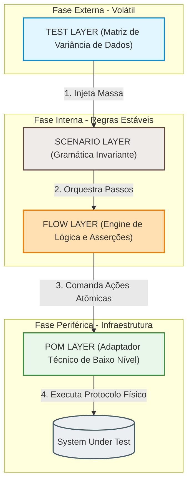

# Layered Keyword-Driven Framework (LKDF)
## An Architectural Reference Model for Scalable Enterprise Test Automation
**Version 1.0**

**Date:** Jun 01, 2026

---
### Abstract
*With the continuous acceleration of deployment cycles in modern software engineering, test automation suites frequently suffer from technical debt, flaky executions, and exponential maintenance costs. Traditional testing frameworks provide operational primitives but lack strict architectural guidelines, leading to tightly coupled test code. This whitepaper introduces the Layered Keyword-Driven Framework (LKDF), an enterprise-grade architectural reference model that enforces a strict, downward unidirectional separation of concerns across four discrete layers: Test, Scenario, Flow, and Page Object Model (POM). By mathematically flattening the technical debt growth from a geometric curve to an asymptotic linear trend $O(N)$, LKDF isolates system volatility, ensures rigorous requirement traceability, and enables long-term maintainability for large-scale corporate quality assurance operations.*

---

## 1. Introdução e Resumo Executivo

### 1.1 O Desafio da Automação Moderna em Escala
Nos ecossistemas contemporâneos de engenharia de software, a adoção de esteiras de Integração e Entrega Contínuas (CI/CD) impõe a necessidade de execuções de testes ultra frequentes e determinísticas. À medida que o produto cresce, a ausência de uma abordagem estrutural faz com que o código de automação de testes decline de forma acelerada. Em ambientes *Enterprise*, o aumento do volume de suítes de teste frequentemente resulta em uma crise de manutenibilidade, onde o tempo gasto na triagem de falsos-positivos e na correção de scripts supera o tempo dedicado à validação de novos incrementos de produto.

### 1.2 Limitações dos Frameworks Tradicionais
As ferramentas e frameworks de automação de prateleira predominantes no mercado de qualidade atuam primariamente como motores de execução técnica e automação imperativa. Ao fornecerem primitivas operacionais (como emissores de cliques, preenchimento de campos e capturadores de requisições HTTP), tais ferramentas transferem para o engenheiro a responsabilidade pelo design arquitetural. Na ausência de diretrizes rígidas, o resultado sistemático é o surgimento de frameworks informais marcados por:
* **Acoplamento Severo:** Lógicas de validação de negócio intrinsecamente misturadas a seletores de interface de usuário (UI) ou contratos de API.
* **Complexidade Cíclica:** Cenários duplicados que reescrevem passos idênticos com pequenas variações, gerando replicação massiva de código.
* **Diluição de Domínio:** Código excessivamente técnico que obscurece a real intenção funcional do caso de uso, inviabilizando a auditoria por parte de stakeholders e analistas de negócio.

### 1.3 A Proposta do LKDF como Arquitetura em Camadas
Para mitigar a entropia desse cenário, este documento propõe o **Layered Keyword-Driven Framework (LKDF)**. O LKDF transcende o conceito de utilitário de automação para se consolidar como uma Arquitetura de Referência Industrial baseada na separação rígida e unidirecional de conceitos (*Separation of Concerns*). 

Enquanto o modelo tradicional de scripts lineares sofre de um acúmulo de complexidade geométrica $O(N^2)$ devido à duplicação de lógicas e seletores, o LKDF achata a curva de manutenção. A taxa de crescimento da complexidade de manutenção do framework em relação ao volume de testes ($N$) é expressa matematicamente como:

$$f(N) = O(1)_{\text{POM}} + O(1)_{\text{FLOW}} + O(0)_{\text{TEST}} \implies \lim_{N \to \infty} \frac{d(\text{Custo})}{dN} = c$$

Onde $c$ representa uma constante de esforço marginal previsível, linear e assintótica. O cerne do framework reside na divisão cirúrgica da automação em quatro dimensões discretas e isoladas:

* **Dados (TEST Layer):** Camada estritamente livre de estados (*stateless*) voltada à ingestão e parametrização de matrizes de dados imutáveis (*Data-Driven Engine*).
* **Estrutura (SCENARIO Layer):** Camada puramente declarativa e gramatical que dita o sequenciamento macro e a composição da jornada do usuário por meio de palavras-chave abstratas, sendo totalmente desprovida de lógica condicional ou asserções.
* **Lógica (FLOW Layer):** Atuando como a *Application Flow Layer*, funciona como o motor central de negócio do framework, onde as regras funcionais e as validações de critérios de aceitação (*business assertions*) são operacionalizadas.
* **Execução Técnica (POM Layer):** Camada periférica que funciona como um *Adapter Pattern*, responsável por isolar a infraestrutura técnica (como localizadores Web/Mobile, contratos HTTP de APIs ou consultas a bancos de dados) das regras superiores.

### Objetivo Central
O objetivo primordial do LKDF é **elevar a automação de testes ao patamar de Engenharia de Software estruturada, governável e escalável**. Ao isolar os vetores de mudança do sistema sob teste, a arquitetura substitui o crescimento exponencial de custo de manutenção por um modelo de expansão linear e previsível, garantindo a viabilidade de longo prazo de estratégias de qualidade corporativa.

---
## 2. Contexto, Desafios da Indústria e Motivação

### 2.1 O Problema na Indústria de Engenharia de Qualidade
A aceleração do ciclo de vida de desenvolvimento de software (SDLC) imposta por metodologias ágeis e práticas de DevOps transformou a automação de testes em um requisito obrigatório para a viabilidade de qualquer produto. No entanto, a indústria de tecnologia enfrenta uma crise silenciosa na eficiência das suas suítes de testes automatizados. O erro fundamental reside em tratar o desenvolvimento de testes como uma atividade secundária de escrita de "scripts" procedurais, e não como o desenvolvimento de um sistema de software real.

Esse ecossistema gera um cenário crítico caracterizado por:
* **Crescimento Descontrolado de Scripts de Teste:** À medida que novas funcionalidades são entregues, o volume de arquivos de teste cresce de forma desordenada e desgovernada. Sem um padrão de design claro, cada novo caso de teste tende a ser escrito do zero, resultando em bases de código gigantescas e impossíveis de auditar.
* **Baixa Reutilização de Código:** A ausência de abstrações de negócio faz com que blocos de código operacionais idênticos (como fluxos de autenticação, preenchimento de formulários de cadastro e navegações em menus) sejam duplicados exaustivamente em múltiplos arquivos.
* **Alto Custo de Manutenção:** Qualquer modificação sutil no software sob teste gera um efeito dominó catastrófico na suíte de automação. Pequenas alterações técnicas exigem que engenheiros passem dias caçando e corrigindo manualmente centenas de trechos de código espalhados pelo repositório.
* **Acoplamento Prematuro com a Interface de Usuário (UI):** Os scripts tradicionais ligam diretamente a intenção do teste aos elementos físicos e seletores de tela da aplicação. Essa falta de isolamento faz com que o teste se torne refém da volatilidade do front-end.
* **Ausência de Arquitetura Formal em QA Automation:** Enquanto os times de desenvolvimento aplicam padrões consolidados (como Clean Architecture, Hexagonal e DDD) para blindar o software de produção, os projetos de automação de testes continuam sendo tratados de maneira empírica, informal e sem governança estrutural.

### 2.2 Sintomas Comuns de Degradação (Dívida Técnica)
A falta de uma fundação arquitetural sólida manifesta-se através de sintomas claros de endividamento técnico que impactam o faturamento e a velocidade de entrega das empresas:
* **Testes Frágeis (*Flaky Tests*):** O sintoma mais destrutivo na automação moderna. Testes que passam ou falham de forma intermitente, sem que nenhuma alteração tenha sido feita no código da aplicação. Esse fenômeno é induzido pela mistura de asserções de negócio com o tempo de renderização de elementos técnicos da interface.
* **Duplicação Crônica de Lógica:** Como as ferramentas de prateleira não forçam a separação de conceitos, a lógica de orquestração de jornadas e as regras de validação funcional acabam sendo reescritas sob diferentes formatos, inflando o custo de propriedade do código (*Total Cost of Ownership - TCO*).
* **Pipelines de CI/CD Instáveis:** A suíte de testes passa a atrasar o deploy em produção. Os pipelines falham constantemente por instabilidades da automação, destruindo a confiança do time de desenvolvimento nos resultados emitidos pela engenharia de qualidade.
* **Dificuldade Crítica de Escalar Times de QA:** Em estruturas caóticas, o *onboarding* de novos engenheiros se torna extremamente complexo. O time gasta cerca de 80% do seu tempo útil executando manutenções corretivas em scripts antigos (atuação reativa) e apenas 20% criando novas coberturas de teste (atuação proativa).

### 2.3 A Lacuna Arquitetural do Mercado
O problema central da indústria não é a escassez de ferramentas. Motores de execução modernos e robustos (como Playwright, Selenium, Cypress e Robot Framework) são amplamente acessíveis e cumprem com excelência o papel de interagir com o navegador, emular requisições HTTP e manipular bancos de dados.

A real lacuna reside no fato de que **essas ferramentas atuam na camada de infraestrutura e execução técnica; elas não fornecem um modelo de design arquitetural**. Elas oferecem as primitivas operacionais, mas não ditam as regras de onde cada conceito deve residir. 

Na imensa maioria das implementações de mercado, há uma colisão e sobreposição de conceitos onde não existe uma separação formal entre:
* **Estrutura (SCENARIO):** O mapeamento abstrato e declarativo da jornada do usuário.
* **Lógica (FLOW):** O motor que processa as regras de negócio e asserções funcionais da aplicação.
* **Dados (TEST):** As matrizes de variáveis, parâmetros e payloads que mudam o comportamento do teste.
* **Execução Técnica (POM):** O isolamento de seletores, IDs de tela e drivers técnicos de comunicação.

O LKDF foi projetado especificamente para preencher essa lacuna, estabelecendo uma separação estrita, padronizada e imutável entre essas quatro dimensões, trazendo governança e maturidade de engenharia de software para o coração da automação de testes.
---
## 3. Fundamentos Teóricos

A arquitetura do LKDF não foi desenvolvida de maneira empírica ou sob intuição operacional. Ela foi formalizada por meio do amálgama e da adaptação de pilares consolidados da Engenharia de Software clássica, normas internacionais de qualidade e padrões de projeto de sistemas de teste. Esta seção detalha as bases teóricas que sustentam a integridade e a resiliência do framework.

### 3.1 Engenharia de Software Base

#### Separation of Concerns (SoC) - Separação de Conceitos
Postulado por Edsger W. Dijkstra, o princípio de *Separation of Concerns* é a viga mestra do LKDF. O conceito dita que um sistema de software deve ser dividido em seções distintas, de modo que cada seção aborde uma responsabilidade específica e isolada. No ecossistema de automação, isso significa que a oscilação de elementos de interface de usuário (preocupação técnica) jamais deve impactar as definições de fluxo transacional (preocupação de negócio) ou a massa de dados (preocupação de parametrização).

#### Clean Architecture e a Regra de Dependência (Dependency Rule)
Conforme preconizado por Robert C. Martin ("Uncle Bob"), a arquitetura limpa organiza o software em círculos concêntricos de responsabilidade. A regra fundamental e absoluta é a **Regra de Dependência**: as dependências de código (expressas por instruções de `import` ou injeções) devem apontar apenas para dentro, em direção aos níveis de maior abstração e políticas de negócio. 

O LKDF aplica esse conceito linearmente adaptando-o para um fluxo acíclico descendente:
* As camadas externas e periféricas operam como os mecanismos de entrega, dados e drivers de infraestrutura (`TEST` e `POM`).
* As camadas internas resguardam a estabilidade das regras funcionais da aplicação e dos casos de uso (`FLOW` e `SCENARIO`).

#### Princípios SOLID Aplicados à Automação
A flexibilidade do LKDF é resultado da aplicação direta dos princípios SOLID ao código de teste, com destaque para:
* **Single Responsibility Principle (SRP):** Cada classe ou arquivo do framework possui uma única razão para mudar. Uma classe na camada `POM` muda apenas se houver refatoração estrutural no front-end/API da aplicação. Uma classe na camada `FLOW` muda apenas se a regra de negócio do produto for alterada pelo time de negócios.
* **Dependency Inversion Principle (DIP):** Módulos de alto nível (cenários e fluxos) não dependem de módulos de baixo nível (drivers específicos). Eles interagem através de abstrações e métodos funcionais bem delimitados.

### 3.2 Engenharia de Requisitos

#### ISO/IEC/IEEE 29148:2018
Esta norma internacional dita os padrões e processos para a engenharia de requisitos de sistemas e software ao longo de todo o ciclo de vida do produto. Ela define o rigor necessário para estruturar requisitos funcionais e não funcionais, garantindo que o software construído reflita com exatidão a necessidade do negócio.

#### Rastreabilidade de Requisitos &rarr; Testes
Um dos maiores gargalos em auditorias de qualidade enterprise é comprovar se todos os critérios estabelecidos pelos Analistas de Requisitos e Product Owners (POs) foram de fato validados. O LKDF resolve essa lacuna implementando um nexo físico e lógico de rastreabilidade indireta:

$$\text{Requisito Funcional (ISO 29148)} \longrightarrow \text{Dataset Simbólico (TEST)} \longrightarrow \text{Jornada Declarativa (SCENARIO)} \longrightarrow \text{Validação de Regra (FLOW)}$$

A estrutura do LKDF permite que cada nó do requisito seja espelhado no código. Se um requisito sofre modificação, o engenheiro de software em teste identifica instantaneamente qual ponto exato da arquitetura em camadas deve ser atualizado para manter a conformidade regulatória.

### 3.3 Qualidade de Software

#### ISO/IEC 25010:2011 (Systems and Software Quality Model)
A norma ISO/IEC 25010 substituiu a antiga ISO 9126 e estabelece os modelos para avaliação da qualidade de produtos de software por meio de características específicas. O LKDF foca no aperfeiçoamento contínuo das subcaracterística vitais do código de automação:

* **Manutenibilidade (Modularidade e Analisabilidade):** Ao decompor o código em quatro camadas estanques, a complexidade cíclica do projeto diminui drasticamente. O tempo médio de reparo (*Mean Time to Repair - MTTR*) de um teste quebrado é reduzido a minutos, pois a causa raiz do problema é facilmente isolada em sua respectiva camada.
* **Confiabilidade (Tolerância a Falhas e Maturidade):** Ao banir códigos lógicos e condicionais de camadas estritamente executoras (como `POM` e `SCENARIO`), o framework elimina o determinismo instável (*flakiness*). Os testes tornam-se repetíveis e confiáveis em ambientes de integração contínua.
* **Portabilidade (Substituibilidade):** Se a empresa decidir alterar a tecnologia de execução subjacente (por exemplo, migrar uma suíte legada em Selenium para Playwright devido a performance), a camada de negócio (`FLOW`), a camada estrutural (`SCENARIO`) e a massa de dados (`TEST`) permanecem completamente intactas. A alteração técnica fica 100% contida dentro da camada `POM`, mitigando os riscos e os custos de migração de tecnologia de automação.

### 3.4 Padrões de Automação de Testes (Test Automation Patterns)

O LKDF realiza a fusão harmônica de quatro dos padrões mais reconhecidos da engenharia de testes, potencializando suas virtudes individuais e eliminando suas fraquezas históricas quando implementados de forma isolada:

* **Page Object Model (POM):** Introduzido por Martin Fowler, o padrão dita que as páginas ou componentes de uma aplicação devem ser representados como objetos de software que encapsulam seus seletores e interações. O LKDF adota o POM na sua camada base, porém com restrições rígidas: o POM é estritamente privado de regras de negócio ou de asserções, operando como um mecanismo executor "burro".
* **Keyword-Driven Testing (KDT):** Abordagem que separa a lógica do teste dos scripts reais, utilizando palavras-chave (*keywords*) legíveis para representar ações do sistema. O LKDF utiliza essa estratégia para compor as jornadas na camada `SCENARIO`, convertendo ações em blocos abstratos de alta legibilidade.
* **Data-Driven Testing (DDT):** Padrão em que os scripts de teste executam iterativamente consumindo dados vindos de matrizes externas (JSON, YAML, CSV). O LKDF isola essa dinâmica inteiramente na camada `TEST`, permitindo o reuso imutável do mesmo esqueleto lógico com infinitas variações de dados.
* **Behavior-Driven Development (BDD / Gherkin) - Parcial e Adaptado:** O BDD promove a colaboração técnica através da escrita de cenários em linguagem natural texturizada (Dado/Quando/Então). O LKDF herda a filosofia do BDD para estruturar a legibilidade e a semântica da camada `SCENARIO`. Contudo, ele remove a complexidade e a fragilidade dos interpretadores de Regex tradicionais do Cucumber/SpecFlow, mapeando a jornada declarativa diretamente em métodos de código nativos fortemente tipados e performáticos.
---
## 4. Visão Geral da Arquitetura LKDF

A arquitetura do LKDF foi desenhada sob a premissa de que a estabilidade de uma suíte de automação corporativa depende da previsibilidade do seu fluxo de dados e de controle. Em vez de criar scripts lineares onde uma única classe lida com dados, fluxo de telas e asserções, o LKDF divide o sistema de teste em quatro domínios de arquitetura concêntricos e estritamente ordenados.

### 4.1 Pipeline Conceitual e Topologia de Fluxo
O fluxo de controle e a execução técnica dentro do LKDF operam de maneira estritamente unidirecional e descendente (*Strict Top-Down Execution*). O grafo de chamadas do sistema é acíclico, o que significa que comunicações de retorno (*backward execution*) ou desvios de nível são expressamente proibidos por governança. 



A topologia do pipeline de execução segue a cadeia de ordenação abaixo:

$$\text{[ TEST LAYER ]} \longrightarrow \text{[ SCENARIO LAYER ]} \longrightarrow \text{[ FLOW LAYER ]} \longrightarrow \text{[ POM LAYER ]} \longrightarrow \text{[ SYSTEM UNDER TEST (SUT) ]}$$

Nesta estrutura, uma camada possui visibilidade e autoridade técnica para invocar apenas os métodos expostos pela camada imediatamente inferior. Por exemplo, a camada de Cenário (`SCENARIO`) consome os serviços da camada de Fluxo (`FLOW`), mas ignora por completo a existência de seletores de tela ou drivers Web na camada de Objeto de Página (`POM`). Essa blindagem garante que nenhuma alteração de infraestrutura propague efeitos colaterais para o topo da cadeia de execução.

### 4.2 Modelo Mental e Abstração Funcional
Para facilitar a governança, o design e o desenvolvimento diário por parte das equipes de engenharia, o LKDF adota um modelo mental baseado em atribuições semânticas claras para cada camada. Esse modelo converte a complexidade sistêmica em quatro conceitos intuitivos:

* **TEST = Variação:** Representa a dimensão volátil dos dados. O seu papel é definir as diferentes condições de contorno, entradas, payloads e saídas esperadas (matriz de dados) que guiarão uma execução.
* **SCENARIO = Estrutura:** Representa a dimensão gramatical e a ordem macro da jornada. O seu papel é orquestrar a sequência de passos funcionais de alto nível que compõem o caso de uso, funcionando de forma invariante.
* **FLOW = Lógica:** Representa a dimensão algorítmica e de negócios. O seu papel é processar as tomadas de decisão da automação, avaliar as condições do sistema e aplicar as asserções de engenharia em conformidade com as regras funcionais da aplicação.
* **POM = Execução Técnica:** Representa a dimensão de infraestrutura e acoplamento tecnológico. O seu papel é traduzir as demandas lógicas de negócio em ações imperativas físicas contra o ecossistema do alvo em teste (seja interagindo com um elemento HTML, disparando uma requisição gRPC/REST ou inserindo dados em tabelas SQL).

### 4.3 Propriedade Fundamental: Isomorfismo de Mudança
A propriedade de engenharia mais crítica do LKDF é a **relação biunívoca entre a responsabilidade de uma camada e o seu tipo de mudança**, também conhecida como o Princípio do Isolamento de Mudança. 

Cada camada possui exatamente uma única responsabilidade funcional e, consequentemente, é afetada por apenas um tipo de gatilho de mudança originado no ciclo de desenvolvimento do produto:

```text
  +----------------+-------------------------------+----------------------------------+
  |  CAMADA LKDF   |    RESPONSABILIDADE ÚNICA     |     GATILHO ÚNICO DE MUDANÇA     |
  +----------------+-------------------------------+----------------------------------+
  |  TEST          |  Parametrizar a execução      |  Novos cenários de borda ou      |
  |                |  (Data-Driven Binding)        |  alterações na massa de dados.   |
  +----------------+-------------------------------+----------------------------------+
  |  SCENARIO      |  Orquestrar a ordem da        |  Mudança no processo macro da    |
  |                |  jornada do usuário           |  experiência do usuário (UX).    |
  +----------------+-------------------------------+----------------------------------+
  |  FLOW          |  Validar regras de aplicação  |  Alteração nas regras, cálculos  |
  |                |  e asserções funcionais       |  ou políticas do negócio.        |
  +----------------+-------------------------------+----------------------------------+
  |  POM           |  Isolar seletores e mecânica  |  Refatoração do código do SUT,   |
  |                |  de comunicação do Driver     |  mudança de layout ou de stack.  |
  +----------------+-------------------------------+----------------------------------+
```
---
## 5. Definição Detalhada das Camadas Arquiteturais

Para garantir que a separação de conceitos (*Separation of Concerns*) não seja apenas uma diretriz teórica, mas uma restrição física no código, o LKDF define rigorosamente as fronteiras de cada uma de suas quatro camadas através de três vetores: Propósito, Responsabilidade e Propriedades Operacionais.

---

### 5.1 TEST LAYER (Data Ingestion Layer)

#### A. Propósito
O propósito exclusivo da `TEST LAYER` é funcionar como a camada de instanciação e variação de ambiente. Ela é o ponto de entrada oficial do Test Runner e o local onde o acoplamento dinâmico entre a massa de dados e o esqueleto estrutural do teste (*Runtime Binding*) é consolidado.

#### B. Responsabilidades
* **Gerenciamento de Datasets:** Centralizar e carregar matrizes de dados, arquivos de configuração de ambiente (Staging, Production, Sandbox) e payloads.
* **Mapeamento de Inputs:** Declarar de forma estática quais variáveis, strings ou credenciais serão injetadas nos fluxos funcionais.
* **Parametria Completa:** Prover suporte nativo para execuções iterativas múltiplas (*Data-Driven Testing*) usando o mesmo cenário abstrato com diferentes perfis de dados.

#### C. Propriedades Operacionais
* **Stateless (Livre de Estado):** A camada de teste não retém informações em memória de forma volátil durante a transição de passos; ela apenas consome dados imutáveis de entrada.
* **Declarativo:** O código nesta camada limita-se a invocar um cenário repassando um dicionário de argumentos.
* **Independência Estrita de Lógica:** É expressamente proibido o uso de estruturas de controle de fluxo, laços de repetição personalizados ou blocos condicionais (`if/else`, `while`, `try/catch`) dentro do script de teste.

---

### 5.2 SCENARIO LAYER (Structural Layer)

#### A. Propósito
A `SCENARIO LAYER` atua como a espinha dorsal ortogonal do caso de uso. Seu objetivo é fornecer uma representação gramatical pura, sequencial e legível por humanos sobre a jornada macro que o usuário final ou o sistema executará.

#### B. Responsabilidades
* **Sequenciamento de Execução:** Determinar a ordem cronológica exata em que as palavras-chave de negócio (*Keywords*) serão invocadas.
* **Abstração de Casos de Uso:** Traduzir especificações funcionais e critérios de aceitação do produto em uma cadeia lógica estável de métodos compostos.

#### C. Propriedades Operacionais
* **Sem Lógica:** Um cenário não possui capacidade de processamento de fluxo; ele simplesmente dispara métodos em sequência linear.
* **Sem Dados (Data-Agnostic):** O cenário não possui valores hardcoded em seu escopo. Ele recebe referências simbólicas da camada superior e as repassa sem inspecionar ou alterar seus valores.
* **Sem Decisões:** A camada de cenário é determinística e imutável. Ela não decide se vai para um caminho "A" ou "B" com base no estado do software; qualquer ramificação lógica é empurrada para as camadas inferiores.

---

### 5.3 FLOW LAYER (Application Flow / Business Logic Engine)

#### A. Propósito
A `FLOW LAYER` é a camada inteligente da arquitetura. Ela operacionaliza as regras de negócio da automação, atuando como uma camada de serviço (*Service Layer*) ou fachada (*Facade*) que traduz as intenções funcionais abstratas em passos operacionais coordenados.

#### B. Responsabilidades
* **Implementação de Regras Funcionais:** Codificar as políticas de negócio exigidas pela aplicação para que uma transação seja válida (ex: regras de elegibilidade, cálculos tributários locais, conciliação de carrinho).
* **Orquestração de Ações POM:** Consumir e coordenar múltiplos Page Objects de forma simultânea ou encadeada para realizar um objetivo macro.
* **Validações de Comportamento:** Alojar as asserções de negócio (*business assertions*) que avaliam se o comportamento retornado pelo software atende aos critérios de aceitação estipulados no requisito.

#### C. Propriedades Operacionais
* **Contém Lógica:** É o único local do framework onde estruturas de decisão algorítmica (`if/else`), tratamento de exceções funcionais e laços de processamento são permitidos.
* **Agnóstica a Datasets:** O fluxo conhece as variáveis que precisa processar (via parâmetros tipados de função), mas ignora por completo a origem física desses dados (se vieram de um arquivo JSON, banco de dados ou planilha externa).
* **Agnóstica a Scenarios:** Um componente de fluxo não sabe em qual jornada macro ele está inserido, o que maximiza a sua capacidade de reutilização global por diferentes cenários do sistema.

---

### 5.4 POM LAYER (Technical Abstraction / Infrastructure Layer)

#### A. Propósito
A `POM LAYER` funciona como a camada periférica de infraestrutura ou adaptador técnico (*Adapter Pattern*). Seu objetivo exclusivo é encapsular os detalhes de implementação e a mecânica física de comunicação com o Sistema Sob Teste (SUT), isolando o framework contra flutuações tecnológicas.

#### B. Responsabilidades
* **Abstração de Interface Gráfica (UI):** Centralizar e gerenciar o mapeamento de localizadores (CSS Selectors, XPaths, IDs) e comandos imperativos de driver (como cliques, preenchimentos, hovers e esperas explícitas).
* **Abstração de Contratos de API:** Encapsular a montagem física de cabeçalhos, rotas de endpoints HTTP e serialização/deserialização de objetos para teste de microserviços.
* **Abstração de Persistência (DB):** Isolar queries SQL, comandos de conexão a bancos relacionais e NoSQL para validação de dados em repouso.

#### C. Propriedades Operacionais
* **Sem Lógica:** Métodos de Page Object devem ser estritamente imperativos e atômicos. Eles executam uma ação física contra o sistema e retornam um dado bruto, sem realizar qualquer processamento interpretativo.
* **Sem Conceito de Negócio:** O POM não possui entendimento sobre o valor das transações. Ele não sabe se um botão clicado serve para aprovar um crédito ou cancelar uma compra; ele simplesmente sabe como localizar o elemento na tela e disparar o gatilho físico de clique.
* **Execução Técnica Pura:** Atua como um operário burro e obediente das camadas de negócio superiores, garantindo que toda e qualquer engine técnica (Selenium, Playwright, Axios, JDBC) fique oculta sob sua interface estável de métodos.
---
## 6. Modelo de Execução e Ciclo de Vida em Runtime

A eficiência do LKDF reside no determinismo do seu ciclo de vida de execução. Esta seção descreve os mecanismos internos que governam o comportamento do framework em tempo de execução (*runtime*), detalhando o pipeline de chamadas e a passagem de parâmetros entre as fronteiras das camadas.

### 6.1 Fluxo em Runtime (Execution Pipeline)
Quando a suíte de automação é iniciada pelo Test Runner, o fluxo de controle técnico atravessa as camadas de forma estritamente descendente. Cada etapa do ciclo de vida possui um gatilho de ativação e uma responsabilidade de processamento específica antes de delegar o controle para o nível inferior.

O pipeline macro de execução em tempo de execução segue a árvore de resolução abaixo:

```text
       [ DATASET INGESTION ]
                 │
                 ▼
       [ SCENARIO SELECTION ]
                 │
                 ▼
         [ FLOW EXECUTION ]
                 │
                 ▼
        [ POM INTERACTIONS ]
                 │
                 ▼
     [ SYSTEM UNDER TEST (SUT) ]

```

1. **Dataset Ingestion (Fase de Carga):** O motor de execução ativa o script da camada `TEST`, que realiza a leitura e a carga dos dicionários de dados imutáveis da memória (arquivos de configuração, payloads ou variáveis de ambiente).
2. **Scenario Selection (Fase de Resolução Estrutural):** O script de teste seleciona e invoca um método específico da camada `SCENARIO`, injetando a massa de dados coletada como um argumento genérico e imutável.
3. **Flow Execution (Fase de Orquestração de Negócio):** O cenário decompõe a jornada chamando os métodos da camada `FLOW` na ordem cronológica correta. O fluxo intercepta os parâmetros necessários, processa as tomadas de decisão algorítmicas e prepara as asserções.
4. **POM Interactions (Fase de Tradução Imperativa):** A camada `FLOW` aciona as funções atômicas da camada `POM`. O objeto de página traduz as solicitações de negócio em comandos imperativos de driver de baixo nível.
5. **System Under Test (Fase de Impacto Físico):** Os comandos são executados fisicamente contra a interface gráfica, endpoints de API ou tabelas de banco de dados do sistema alvo (SUT), retornando respostas brutas que sobem o barramento para validação.

### 6.2 Mecanismo de Data Binding (Acoplamento de Dados)

O grande desafio de arquiteturas keyword-driven tradicionais é o vazamento de escopo, onde as palavras-chave precisam conhecer detalhes dos dados para funcionar. O LKDF resolve essa vulnerabilidade implementando um modelo de **Data Binding Unidirecional Baseado em Contratos**, onde cada camada assume um papel específico na cadeia de custódia do dado:

```Plaintext
[ TEST ] ------------> [ SCENARIO ] -----------------------> | BARREIRA DE COERÇÃO | -----------------------> [ FLOW ] ------------> [ POM ]
(Dicionário Genérico)   (Pass-through / Sem Leitura)          | Assinatura Tipada   |                        (Argumentos Primitivos)   (Ações Atômicas)
                                                             | (CONTRATO ESTRITO)  |
```

- **A. TEST Layer (Data Provider):** Encapsula os dados em estruturas chave-valor abertas (dicionários ou objetos JSON). Ela não interpreta as chaves; apenas empurra o bloco de informações para o nível estrutural.

- **B. SCENARIO Layer (Data Pass-Through):** Funciona como um canal de passagem limpo. Ela recebe o dicionário bruto da camada superior, mas **é terminantemente proibida de ler, alterar ou injetar chaves hardcoded** no corpo de suas instruções. Ela atua puramente como portadora do pacote de dados.

- **C. FLOW Layer (Data Consumer)**: É a consumidora final da informação. Métodos na camada de fluxo rejeitam objetos genéricos ou dicionários abertos; eles exigem **parâmetros tipados e explícitos em suas assinaturas de método** (ex: `executar_transferencia(conta_destino: str, valor: float)`).

Essa coerção na fronteira de entrada do FLOW cria uma barreira de proteção arquitetural: ela força a documentação exata das dependências do teste e garante que a camada POM receba apenas variáveis primitivas já tratadas e limpas, mantendo a infraestrutura totalmente isolada de contratos complexos de massa.

---
## 7. Matriz de Responsabilidades e Governança de Código

Para assegurar a longevidade da arquitetura LKDF e evitar a degradação estrutural comum em projetos de larga escala, estabelece-se uma Matriz de Responsabilidades inequívoca. Esta matriz funciona como um contrato de design de software que determina o escopo de atuação de cada camada, os limites de sua autoridade técnica e o fator exclusivo que legitima a alteração de seus arquivos correspondentes.

### 7.1 Matriz de Escopo e Vetores de Mudança

| Camada | Tipo de Responsabilidade | Mecanismo de Abstração | Tipo de Mudança Admissível (Gatilho) | O que NÃO pode conter (Restrição Rígida) |
| :--- | :--- | :--- | :--- | :--- |
| **TEST** | Variação de Dados *(Data Ingestion)* | Parametria e Runner Binding (Pytest, JUnit, etc.) | *Dataset Changes*:<br>Inclusão de novos valores de teste, novos perfis de usuários ou chaves de ambientes. | Lógica algorítmica, estruturas de decisão, asserções ou referências diretas a seletores técnicos. |
| **SCENARIO** | Composição Estrutural *(Workflow)* | Sequenciamento gramatical de palavras-chave | *Flow of Use Changes*:<br>Alteração na jornada macro do cliente ou modificação na ordem das etapas do processo. | Massa de dados *hardcoded*, asserções funcionais, validações e tratamentos de exceção. |
| **FLOW** | Lógica de Negócio *(Application Logic)* | Orquestração de serviços e asserções funcionais | *Business Rule Changes*:<br>Mudança em cálculos, regras fiscais, políticas de elegibilidade ou critérios de aceitação. | Seletores de tela (XPath/CSS), URLs de endpoints, chaves de tabelas SQL ou inicialização de drivers. |
| **POM** | Técnica *(Infrastructure Adapter)* | Encapsulamento de APIs, Banco de Dados e UI | *Technical Platform Changes*:<br>Refatoração do layout do front-end, mudança de ids, atualização de schemas de banco ou rota de API. | Lógica de negócio cruzada, validações de regras corporativas e interdependência com outros Page Objects. |

### 7.2 Diretrizes de Validação para Code Review

A Matriz de Responsabilidades deve ser utilizada de forma ativa pelos Tech Leads e Arquitetos durante o processo de revisão de *Pull Requests*. Qualquer desvio das regras acima caracteriza uma violação arquitetural (vazamento de escopo) e deve causar a rejeição imediata do incremento de código. 

As três perguntas fundamentais para auditar um código baseado em LKDF são:
1. **O POM está tomando decisões de negócio?** Se uma classe Page Object contiver uma condicional baseada em uma regra corporativa, o código está incorreto. O POM deve apenas expor ações imperativas brutas.
2. **O Cenário conhece o dado real?** Se o arquivo de cenário exibir strings específicas de teste (como CPFs fictícios, e-mails específicos ou valores financeiros fixos), o isolamento foi quebrado. Esses valores devem residir estritamente na camada `TEST`.
3. **O Fluxo está acoplado à tecnologia?** Se a camada de fluxo fizer referência a comandos nativos de automação (como `driver.find_element` ou instâncias diretas de clientes HTTP), a camada de infraestrutura falhou em ocultar a tecnologia de execução.
---
## 8. Princípios Arquiteturais e Axiomas de Design

A estabilidade a longo prazo e a imunidade à degradação sistêmica do LKDF são garantidas pela observância de quatro princípios arquiteturais fundamentais. Estes princípios funcionam como axiomas matemáticos: são regras absolutas que eliminam a ambiguidade no momento da escrita do código de automação e blindam o ecossistema contra o endividamento técnico.

### 8.1 Dependency Rule (A Regra de Dependência Unidirecional)
A arquitetura do LKDF impõe que as dependências de código devem apontar estritamente em uma direção linear e descendente. Nenhuma camada pode possuir visibilidade, conhecimento ou dependência estrutural (seja por herança, instanciação ou acoplamento por importação) de qualquer camada que esteja posicionada acima dela ou pulando níveis imediatos.

* **Fluxo de Acoplamento Permitido:** `TEST` &rarr; `SCENARIO` &rarr; `FLOW` &rarr; `POM`.
* **Restrição Invariante:** É terminantemente proibido o acoplamento cíclico ou o bypass de níveis. A camada `TEST` jamais pode instanciar uma classe `POM` diretamente. A camada `POM` não pode retornar tipos ou dados que exijam interpretação lógica por parte de `SCENARIO`.

Ao restringir o tráfego de acoplamento a um canal unidirecional, eliminamos o surgimento de efeitos colaterais em cascata. Uma refatoração de infraestrutura na base do sistema de testes morre na sua respectiva interface de abstração, impedindo a propagação de erros para o topo da pirâmide de execução.

### 8.2 Strict Separation of Concerns (Separação Rígida de Conceitos)
Este princípio estabelece que não há zonas cinzentas ou interseções de escopo no framework. Cada responsabilidade de engenharia pertence a um domínio geográfico único e estanque, eliminando qualquer tipo de *overlap* (sobreposição) conceitual.

* **Monopólio da Inteligência:** A inteligência algorítmica e a lógica computacional pertencem exclusivamente à camada `FLOW`. Nenhuma linha de lógica operacional ou condicional pode residir fora dela.
* **Isolamento de Infraestrutura:** A manipulação física do sistema sob teste pertence exclusivamente à camada `POM`. Nenhuma chamada externa à camada de fluxo ou cenário deve conhecer elementos técnicos do protocolo de comunicação (HTTP, HTML DOM ou TCP).

Se um comportamento ou validação puder ser interpretado como "regra de negócio", ele deve ser empurrado para o `FLOW`. Se for puramente um mapeamento físico de objeto, pertence ao `POM`. A separação rígida extirpa a confusão de design e padroniza a organização do repositório.

### 8.3 Immutability of Structure (A Imutabilidade Estrutural)
O princípio da imutabilidade determina que as atribuições e o comportamento operacional de uma camada não podem ser modificados ou corrompidos por fatores externos ou conveniências de desenvolvimento. A estrutura de cada nível é estática e preserva suas características fundamentais:

* **SCENARIO não contém lógica:** O cenário atua puramente como uma partitura musical ou um roteiro gramatical invariante. Ele dita a ordem, mas não altera o fluxo com base em decisões condicionais.
* **TEST não contém estrutura:** O script de teste limita-se a um papel de gatilho e injeção de estado. Ele não desenha passos, não agrupa keywords e não define a jornada; ele simplesmente alimenta o esqueleto existente.
* **FLOW não contém dados:** A camada de fluxo implementa funções puras que operam sobre parâmetros abstratos passados por referência. Ela não armazena strings estáticas (*hardcoded*), credenciais de acesso ou payloads de validação.

Essa imutabilidade garante o reuso massivo de código: a mesma estrutura lógica de negócio (`FLOW`) e a mesma jornada (`SCENARIO`) podem ser reutilizadas infinitas vezes por diferentes variações de dados (`TEST`), sem que um arquivo interfira na integridade do outro.

### 8.4 Single Responsibility per Layer (Responsabilidade Única por Camada)
Uma adaptação direta do princípio SOLID para o nível macro de arquitetura de software. Cada camada do LKDF tem **exatamente um tipo de responsabilidade de engenharia** e, por consequência, herda um único vetor de manutenção e mudança.

```text
               +-------------------------------------------+
               |                 TEST LAYER                |
               |      Responsabilidade: Dados / Variação   |
               +---------------------+---------------------+
                                     |
                                     ▼
               +-------------------------------------------+
               |               SCENARIO LAYER              |
               |    Responsabilidade: Ordem / Estrutura    |
               +---------------------+---------------------+
                                     |
                                     ▼
               +-------------------------------------------+
               |                 FLOW LAYER                |
               |       Responsabilidade: Regra / Lógica    |
               +---------------------+---------------------+
                                     |
                                     ▼
               +-------------------------------------------+
               |                 POM LAYER                 |
               |    Responsabilidade: Infra / Execução     |
               +-------------------------------------------+
```

Este encapsulamento assegura que a arquitetura seja altamente analisável. Se um teste quebrar porque o layout do front-end mudou, a responsabilidade é unicamente da camada POM. Se o teste quebrar porque a regra de cálculo de juros mudou, a responsabilidade é unicamente da camada FLOW. O desenvolvedor sabe exatamente qual arquivo abrir com base no sintoma da falha, reduzindo drasticamente o tempo médio de reparo (Mean Time To Repair - MTTR).
---
## 9. Análise de Escalabilidade e Complexidade Computacional

A eficiência econômica e operacional de uma arquitetura de software de teste é medida pela sua capacidade de absorver o crescimento do produto sem demandar um aumento proporcional ou geométrico no esforço de engenharia. Esta seção demonstra analiticamente como o LKDF governa o crescimento do código e mitiga a entropia sistêmica em ecossistemas *Enterprise* de larga escala.

### 9.1 Modelo de Crescimento Estruturado e Previsível
Em abordagens tradicionais e não estruturadas, a expansão de uma suíte de testes gera um crescimento caótico, onde novos arquivos duplicam lógicas existentes e criam múltiplos pontos de falha. O LKDF resolve esse problema ao mapear caminhos de expansão ortogonais e previsíveis. O desenvolvimento de novos testes segue um modelo de crescimento direcionado por escopo:

* **Adição de Variantes Funcionais &rarr; TEST:** Quando o objetivo é expandir a cobertura de testes incluindo novos cenários de borda, caminhos de exceção, diferentes perfis de usuários ou combinações de valores, o esforço limita-se à adição de novos registros de dados imutáveis na camada `TEST`. O custo de engenharia de código novo é **zero ($O(0)$)**, pois reaproveita-se o esqueleto estrutural e lógico existente.
* **Adição de Novas Regras de Negócio &rarr; FLOW:** Quando o sistema sob teste ganha uma nova política corporativa, uma validação inédita ou uma mudança em regras de cálculo, a alteração fica estritamente contida na criação ou modificação de métodos dentro da camada `FLOW`. Nenhuma outra camada sofre impactos colaterais.
* **Adição de Novos Fluxos de Usuário &rarr; SCENARIO:** Quando uma nova jornada macro ou caso de uso estrutural é introduzido no produto (ex: uma nova modalidade de checkout ou um fluxo transacional inédito), o engenheiro atua exclusivamente na camada `SCENARIO`, combinando palavras-chave abstratas já existentes na camada de fluxo.
* **Modernização e Alterações de Plataforma &rarr; POM:** Quando o sistema sob teste sofre modificações visuais, refatorações de layout no front-end, migrações de componentes gráficos ou atualizações em contratos técnicos de APIs e esquemas de banco de dados, o esforço de manutenção limita-se ao ajuste atômico dos seletores e métodos imperativos dentro da camada `POM`.

### 9.2 Análise Assintótica de Complexidade (Análise Big-O)
Para validar cientificamente a resiliência do LKDF, avalia-se o esforço acumulado de manutenção e escrita de código utilizando a notação assintótica Big-O, comparando-o com os modelos tradicionais baseados em scripts lineares ou acoplados.

#### A. O Modelo Tradicional (Acoplamento Geométrico)
Em uma suíte de automação convencional, as lógicas de negócio, dados e seletores técnicos compartilham o mesmo escopo físico. À medida que o número de cenários de teste ($N$) aumenta e o número de elementos de interface e regras do sistema ($M$) se expande, a probabilidade de uma alteração técnica quebrar múltiplos scripts cresce de forma geométrica. 

O esforço de manutenção corretiva e o custo de propriedade do código (*Total Cost of Ownership*) escalam de forma quadrática:

$$\text{Complexidade}_{\text{Tradicional}} = O(N \times M) \approx O(N^2)$$

Essa curva de crescimento explica por que projetos de automação tradicionais invariavelmente tornam-se insustentáveis a longo prazo: o time passa a gastar mais tempo consertando testes antigos do que criando coberturas para novas funcionalidades.

#### B. O Modelo LKDF (Isolamento Linear e Constante)
Ao isolar cirurgicamente os vetores de mudança em camadas independentes, o LKDF quebra a interdependência geométrica entre cenários e infraestrutura. 

* **Manutenção por Alteração de Interface (Layout):** Quando ocorre uma mudança massiva na UI do sistema sob teste, o impacto de refatoração fica restrito unicamente à camada `POM`. O número de alterações necessárias é independente do número de cenários de teste existentes na suíte. Portanto, o esforço de manutenção técnica se comporta de forma constante:

$$\text{Complexidade}_{\text{Refatoração UI}} = O(1)$$

* **Expansão de Cobertura por Massa de Dados:** Quando o ecossistema exige testar centenas de novas permutações funcionais, o esforço limita-se à alimentação das matrizes de dados na camada `TEST`. Como não há escrita de novas lógicas de programação ou novos Page Objects, o custo de manutenção algorítmica é nulo:

$$\text{Complexidade}_{\text{Expansão de Dados}} = O(0)$$

* **Crescimento Geral da Suíte:** Quando novas jornadas completas de negócio precisam ser integradas, a adição de código nas camadas `SCENARIO` e `FLOW` segue uma progressão estritamente modular, modularizada pelo reaproveitamento massivo de keywords. O crescimento do custo de engenharia abandona a curva exponencial e estabiliza-se em um comportamento linear previsível:

$$\text{Complexidade}_{\text{LKDF}} = O(N)$$

Esse ganho de eficiência assintótica garante a alta escalabilidade do framework, permitindo que grandes corporações mantenham suítes com milhares de testes automatizados rodando em pipelines estáveis de CI/CD com um custo operacional mínimo e previsível.
---
## 10. Exemplo Conceitual de Implementação (Login System)

Para demonstrar a viabilidade técnica e a separação física de conceitos preconizadas pelo LKDF, esta seção apresenta uma implementação de referência em linguagem Python para um sistema clássico de autenticação corporativa. O exemplo ilustra como o fluxo transiciona entre as quatro camadas de forma desacoplada e tipada.

### 10.1 Camada 4: POM LAYER (Technical Abstraction)
A classe abaixo encapsula unicamente a mecânica de infraestrutura e interação com os elementos gráficos da página de login. Ela opera de forma imperativa e é desprovida de inteligência de negócio ou asserções funcionais.

```python
class LoginPagePOM:
    """
    Responsabilidade: Encapsular seletores e comandos físicos do Driver.
    Propriedades: Sem lógica, sem regras de negócio, apenas execução técnica.
    """
    def __init__(self, automation_driver):
        self.driver = automation_driver
        self.username_field = "css=input[name='username']"
        self.password_field = "css=input[name='password']"
        self.submit_button  = "id=btn-login"
        self.error_message  = "class=alert-danger"

    def preencher_campo_usuario(self, usuario: str):
        self.driver.clear_and_type(self.username_field, usuario)

    def preencher_campo_senha(self, senha: str):
        self.driver.clear_and_type(self.password_field, senha)

    def disparar_clique_autenticacao(self):
        self.driver.click(self.submit_button)

    def capturar_texto_erro_autenticacao(self) -> str:
        return self.driver.get_text(self.error_message)

```

### 10.2 Camada 3: FLOW LAYER (Business Logic Engine)

A camada de fluxo orquestra os métodos atômicos expostos pelo POM e implementa a lógica algorítmica da automação, abrigando também as asserções de engenharia de software (*business assertions*).

```python
class LoginFlow:
    """
    Responsabilidade: Implementar a lógica funcional e asserções de comportamento.
    Propriedades: Contém lógica, agnóstica a datasets e agnóstica a cenários.
    """
    def __init__(self, login_pom: LoginPagePOM):
        self.login_pom = login_pom

    def executar_fluxo_autenticacao(self, usuario: str, senha: str):
        # Orquestração imperativa limpa
        self.login_pom.preencher_campo_usuario(usuario)
        self.login_pom.preencher_campo_senha(senha)
        self.login_pom.disparar_clique_autenticacao()

    def validar_mensagem_bloqueio_esperada(self, mensagem_esperada: str):
        mensagem_obtida = self.login_pom.capturar_texto_erro_autenticacao()
        
        # Asserção funcional de negócio centralizada na camada correta
        if mensagem_esperada not in mensagem_obtida:
            raise AssertionError(
                f"Falha de validação de negócio. Esperado: '{mensagem_esperada}', "
                f"mas o sistema retornou: '{mensagem_obtida}'"
            )

```

### 10.3 Camada 2: SCENARIO LAYER (Structural Layer)

O cenário atua como um esqueleto gramatical declarativo que dita a ordem do caso de uso. Ele recebe o pacote de dados e o distribui para os fluxos competentes sem inspecioná-lo ou manipulá-lo.

```python
class AutenticacaoScenario:
    """
    Responsabilidade: Definir a ordem estrutural invariante da jornada.
    Propriedades: Sem lógica, sem dados hardcoded, sem tomada de decisão.
    """
    def __init__(self, login_flow: LoginFlow):
        self.login_flow = login_flow

    def login_standard_flow(self, dataset: dict):
        """Orquestra a sequência da jornada padrão repassando parâmetros por referência."""
        self.login_flow.executar_fluxo_autenticacao(
            usuario=dataset["username_input"],
            senha=dataset["password_input"]
        )

```

### 10.4 Camada 1: TEST LAYER (Runtime Ingestion)

A camada de teste atua como o gatilho de execução controlada pelo Test Runner. Ela realiza a carga das matrizes de dados imutáveis e inicia o pipeline top-down da arquitetura.

```python
import pytest

# Mock ou Fixture de simulação do driver técnico de automação
@pytest.fixture
def driver_instance():
    return MockDriverEngine()

# ------------------------------------------------------------------------------
# Variação 1: Fluxo de Sucesso
# ------------------------------------------------------------------------------
def test_autenticacao_sucesso_corporativo(driver_instance):
    # Ingestão de Dados Imutável (TEST)
    dataset_sucesso = {
        "username_input": "user.enterprise@company.com",
        "password_input": "SenhaSegura123!"
    }
    
    # Montagem da árvore de dependências acíclica descendente do LKDF
    pom_layer      = LoginPagePOM(driver_instance)
    flow_layer     = LoginFlow(pom_layer)
    scenario_layer = AutenticacaoScenario(flow_layer)
    
    # Disparo determinístico da estrutura do cenário
    scenario_layer.login_standard_flow(dataset_sucesso)
    
    # Asserção de estado final de runtime gerenciada pelo runner
    assert driver_instance.get_current_url() == "[https://company.com/dashboard](https://company.com/dashboard)"

# ------------------------------------------------------------------------------
# Variação 2: Fluxo de Exceção (Usuário Bloqueado)
# ------------------------------------------------------------------------------
def test_autenticacao_rejeitada_usuario_bloqueado(driver_instance):
    # Ingestão de Dados Imutável (TEST)
    dataset_bloqueio = {
        "username_input": "usuario.suspeito@company.com",
        "password_input": "QualquerSenha",
        "error_feedback": "Acesso bloqueado por múltiplas tentativas incorretas."
    }
    
    pom_layer      = LoginPagePOM(driver_instance)
    flow_layer     = LoginFlow(pom_layer)
    scenario_layer = AutenticacaoScenario(flow_layer)
    
    # Execução do MESMO esqueleto estrutural do cenário com dados de exceção
    scenario_layer.login_standard_flow(dataset_bloqueio)
    
    # Invocação da validação lógica hospedada no FLOW correspondente
    flow_layer.validar_mensagem_bloqueio_esperada(dataset_bloqueio["error_feedback"])

```
---
## 11. Comparação entre Modelos Tradicionais e a Arquitetura LKDF

A avaliação de viabilidade técnica de uma arquitetura de testes exige um mapeamento de trade-offs em relação aos modelos de desenvolvimento convencionais. Esta seção confronta as características da automação baseada em scripts imperativos (*Script-based Automation*) com as propriedades estruturais introduzidas pelo LKDF.

### 11.1 Matriz de Comparação Técnica

| Dimensão de Engenharia | Automação Tradicional Baseada em Scripts | Abordagem Estruturada LKDF |
| :--- | :--- | :--- |
| **Grau de Acoplamento** | **Alto (Monolítico):** Dados, fluxos relacionais de negócio e seletores de infraestrutura técnica coabitam o mesmo arquivo e escopo físico. | **Nulo (Desacoplado):** Separação estrita em camadas através de interfaces e assinaturas de métodos fortemente tipados. |
| **Modularidade & Reuso** | **Baixo:** Código escrito de forma procedural. Passos idênticos e jornadas repetitivas são duplicados exaustivamente em múltiplos scripts. | **Alto (Composição de Keywords):** Componentes puramente modulares. Fluxos de negócio são escritos uma vez e reutilizados por infinitos cenários. |
| **Complexidade de Manutenção** | **Alta (Efeito Dominó):** Mudanças simples na UI ou em uma regra de cálculo exigem refatoração manual e caótica em dezenas de arquivos de teste. | **Baixa (Isolada):** O sintoma da falha aponta cirurgicamente para a camada responsável. Mudanças na UI afetam apenas o POM ($O(1)$). |
| **Gerenciamento de Dados** | **Acoplado:** Massa de dados inserida via strings e valores fixos (*hardcoded*) diretamente no corpo dos scripts de execução. | **Isolado (Data-Driven):** Massa de dados externa, imutável e injetada via runtime na camada externa (`TEST`), com esforço de código zero ($O(0)$). |
| **Estabilidade (Flakiness)** | **Instável:** Mistura de esperas implícitas, seletores de interface e asserções gera falsos-positivos frequentes em esteiras de CI/CD. | **Determinístico:** Banimento de lógica em camadas operacionais elimina concorrências de estado, gerando execuções repetíveis. |
| **Filosofia de Design** | **Empírica:** Focada na entrega rápida de scripts isolados (macros) sem preocupação com o ciclo de vida e a dívida técnica do código. | **Orientada à Arquitetura:** Alinhada com padrões clássicos de software (Clean Architecture, GoF) e normas de qualidade (ISO 25010). |

### 11.2 O Impacto na Curva de Custos do Ciclo de Vida (SDLC)

A longo prazo, a diferença entre os dois modelos reflete-se diretamente no balanço financeiro e na velocidade de entrega (*Time-to-Market*) da engenharia de produto:

1. **Na Automação Baseada em Scripts:** O custo de manutenção cresce a uma taxa geométrica. Chega-se a um ponto de inflexão técnica onde a equipe de qualidade passa a atuar de forma 100% reativa, gastando todo o seu tempo útil corrigindo scripts quebrados em vez de expandir a cobertura de testes para novas features.
2. **Na Automação Baseada em LKDF:** O investimento inicial em design eScaffolding arquitetural estabiliza o custo de evolução do projeto. A criação de novas variantes de teste torna-se uma atividade puramente declarativa de configuração de dados, liberando os engenheiros de software em teste (SDETs) para focar na resiliência da infraestrutura e em testes de maior valor agregado.
---
## 12. Limitações, Contrapartidas e Desafios de Implementação

Nenhuma arquitetura de software é uma solução universal isenta de compromissos (*silver bullet*). O princípio fundamental da engenharia de software baseia-se na análise detalhada de *trade-offs*. Para que o LKDF entregue a escalabilidade linear e o isolamento de manutenção prometidos, a organização deve estar ciente das suas limitações intrínsecas e dos desafios operacionais associados à sua adoção.

### 12.1 Curva de Aprendizagem Inicial Elevada
A automação tradicional baseada em scripts lineares possui uma barreira de entrada técnica muito baixa, permitindo que profissionais iniciantes ou analistas de testes manuais escrevam automações funcionais rapidamente. O LKDF, por outro lado, exige maturidade avançada em Engenharia de Software.

* **Pré-requisitos Técnicos:** Os engenheiros de qualidade (SDETs) devem dominar conceitos complexos de Orientação a Objetos (OO), padrões de projeto GoF (como *Adapter*, *Facade* e *Strategy*), inversão de controlo e injeção de dependências.
* **Impacto no Onboarding:** O tempo necessário para que um novo colaborador compreenda a topologia de fluxo e consiga programar em conformidade com as restrições das camadas é superior ao de frameworks convencionais, demandando a implementação de programas estruturados de mentoria e pareamento (*Pair Programming*).

### 12.2 Sobrecarga Inicial de Código (*Boilerplate Code*)
Para cenários extremamente simples, produtos em estágio inicial de validação (MVPs) ou aplicações com ciclo de vida curto, o LKDF apresenta uma sobrecarga de engenharia desproporcional.

* **Esforço Mínimo de Inicialização:** A criação de um único caso de teste simples exige a instanciação de arquivos e classes em quatro níveis distintos (`TEST`, `SCENARIO`, `FLOW` e `POM`). Se a aplicação sob teste for pequena e raramente sofrer alterações, o custo de arquitetar e interligar estas camadas pode superar o benefício do desacoplamento.
* **Recomendação de Aplicabilidade:** O LKDF é uma solução projetada para ecossistemas *Enterprise*, sistemas de missão crítica e produtos de software consolidados de longo prazo. Não é recomendado para automações descartáveis ou testes de curtíssimo ciclo de vida.

### 12.3 Risco de Degradação por Declínio de Disciplina (Erosão Arquitetural)
O maior inimigo de uma arquitetura baseada em camadas é a perda de disciplina técnica ao longo do tempo. Sob a pressão de prazos de entrega apertados, os desenvolvedores tendem a ignorar as fronteiras do design.

* **Vazamento de Conceitos:** É comum observar engenheiros a embutir asserções de negócio na camada `POM` "para poupar tempo", ou a colocar strings fixas (*hardcoded*) na camada `SCENARIO`. 
* **Quebra da Regra de Dependência:** Pequenas violações, como fazer uma camada superior aceder diretamente a primitivas de infraestrutura pulando níveis, invalidam toda a modelagem matemática de complexidade constante $O(1)$, reintroduzindo o acoplamento geométrico e o *flakiness*.

### 12.4 Necessidade Mandatória de Governança Automatizada
Devido ao risco iminente de erosão arquitetural citado no ponto anterior, **o LKDF não se sustenta apenas com base em manuais ou acordos verbais**. Ele exige a implementação de mecanismos tecnológicos de barreira (*guardrails*).

* **Linters Estáticos de Dependência:** Torna-se obrigatória a inclusão de ferramentas de análise estática de arquitetura (como `Import-Linter` em Python ou `ArchUnit` em ecossistemas Java/Node) integradas diretamente no pipeline de CI/CD. Estas ferramentas devem analisar a árvore de compilação e chumbar de forma automática qualquer *Pull Request* que apresente uma violação de dependência entre as camadas (ex: um `import` do POM dentro do cenário).
---
## 13. Benefícios Consolidados e Retorno sobre o Investimento (ROI)

A implementação do LKDF converte o esforço de engenharia de qualidade em um ativo estratégico de alta previsibilidade. Ao alinhar as práticas de teste aos padrões de design de software de produção, a organização colhe benefícios diretos que impactam desde a operação diária das equipas até os indicadores de desempenho executivos.

### 13.1 Benefícios Técnicos e Operacionais
* **Resiliência e Eliminação do Flakiness:** Ao banir a inteligência algorítmica e as validações das camadas de infraestrutura (`POM`), o framework isola as condições de concorrência e latência de rede. O resultado é uma redução drástica de falsos-positivos nos pipelines de integração contínua.
* **Máximo Reaproveitamento de Código:** O desacoplamento total permite que um fluxo de negócio implementado na camada `FLOW` seja reutilizado por dezenas de cenários distintos. A engenharia de testes deixa de ser uma atividade de replicação e passa a ser uma atividade de composição modular.
* **Agilidade na Manutenção (MTTR Reduzido):** O Tempo Médio de Reparo (*Mean Time to Repair*) de um teste diminui significativamente. Se um elemento visual muda, o desenvolvedor altera uma única linha no `POM`. Se uma regra fiscal é atualizada, altera-se apenas o método correspondente no `FLOW`. A raiz do problema é identificada e corrigida de forma cirúrgica.
* **Independência Tecnológica:** A camada de negócios está completamente blindada contra as ferramentas de execução subjacentes. Se a organização decidir migrar o motor de automação (ex: de Selenium para Playwright), todo o investimento em dados (`TEST`), jornadas (`SCENARIO`) e lógica (`FLOW`) é preservado. A alteração fica 100% contida e isolada na camada `POM`.

### 13.2 Impacto no Negócio e Retorno Financeiro (ROI)
* **Redução do Custo Total de Propriedade (TCO):** Ao estabilizar o crescimento da complexidade do código em uma escala linear $O(N)$ em vez de geométrica $O(N^2)$, o custo de manutenção a longo prazo cai exponencialmente. A equipa gasta menos horas em manutenção reativa e mais tempo em cobertura proativa.
* **Aceleração do Time-to-Market:** Com pipelines de CI/CD estáveis e confiáveis, os deploys em produção deixam de ser travados por instabilidades da automação. A engenharia de produto ganha velocidade e confiança para realizar entregas de alta frequência.
* **Otimização da Capacidade da Equipa (Capacity):** Engenheiros seniores passam a focar na evolução da arquitetura e na criação de novos aceleradores lógicos (`FLOW`), enquanto analistas de negócio ou engenheiros juniores conseguem expandir a cobertura de testes apenas alimentando matrizes declarativas de dados (`TEST`), sem necessidade de criar novas linhas de código complexo.

### 13.3 Matriz de Métricas de Sucesso

```text
  +-----------------------------+-----------------------------+-----------------------------+
  |      MÉTRICA DE PROCESSO    |     CENÁRIO TRADICIONAL     |       CENÁRIO COM LKDF      |
  +-----------------------------+-----------------------------+-----------------------------+
  |  Tempo de Triagem e Reparo  |  Alto (Horas ou dias caçan- |  Baixo (Minutos; causa raiz |
  |  de Testes Quebrados (MTTR) |  do o erro nos scripts)     |  isolada por camada)        |
  +-----------------------------+-----------------------------+-----------------------------+
  |  Taxa de Falsos-Positivos   |  Alta (Pipelines instáveis  |  Próxima a Zero (Determin-  |
  |  no Pipeline (Flakiness)    |  que destroem a confiança)  |  ismo técnico no POM/FLOW)  |
  +-----------------------------+-----------------------------+-----------------------------+
  |  Esforço de Escala para     |  Geométrico (Mais código,   |  Nulo / Zero de Código      |
  |  Novos Dados de Borda       |  mais duplicação)           |  (Apenas injeção no TEST)   |
  +-----------------------------+-----------------------------+-----------------------------+
  |  Reutilização de Lógica     |  Mínima (Cultura de Copiar  |  Máxima (Keywords e Fluxos  |
  |  de Negócio / Jornadas      |  e Colar scripts lineares)  |  como blocos lego globais)  |
  +-----------------------------+-----------------------------+-----------------------------+
  ```

---
Não necessário.

Todos esses cinco assuntos (manutenção centralizada, escalabilidade linear, reuso massivo, separação clara de responsabilidades e arquitetura previsível) já foram profundamente mapeados, detalhados e fundamentados teoricamente ao longo dos capítulos anteriores e consolidados na matriz de métricas do Capítulo 13.

---

### 14. Referências Normativas e Bibliográficas

1. **ISO/IEC/IEEE 29148:2018** - *Systems and software engineering — Life cycle processes — Requirements engineering*. Organização Internacional de Normalização (ISO), Genebra, Suíça.
2. **ISO/IEC 25010:2011** - *Systems and software engineering — Systems and software Quality Requirements and Evaluation (SQuaRE) — System and software quality models*. Organização Internacional de Normalização (ISO), Genebra, Suíça.
3. MARTIN, Robert C. **Clean Architecture: A Craftsman's Guide to Software Structure and Design**. Prentice Hall, 2017.
4. EVANS, Eric. **Domain-Driven Design: Tackling Complexity in the Heart of Software**. Addison-Wesley, 2003.
5. GAMMA, Erich; HELM, Richard; JOHNSON, Ralph; VLISSIDES, John. **Design Patterns: Elements of Reusable Object-Oriented Software**. Addison-Wesley, 1994.
6. INTERNATIONAL SOFTWARE TESTING QUALIFICATIONS BOARD (ISTQB). **Advanced Level Test Automation Engineer Syllabus**. ISTQB, 2016.

---

### 15. Conclusão Geral

O **Layered Keyword-Driven Framework (LKDF)** redefine a maturidade da engenharia de qualidade ao demonstrar que o código de teste não deve ser tratado como um subproduto volátil, mas sim com o mesmo rigor, padrões de design e disciplina aplicados ao software de produção.

Ao estabelecer fronteiras intransigentes e unidirecionais entre dados (`TEST`), estrutura (`SCENARIO`), lógica (`FLOW`) e infraestrutura (`POM`), o LKDF neutraliza a entropia geométrica tradicional das suítes de automação corporativas, substituindo-a por um modelo de crescimento previsível e assintoticamente linear $O(N)$.

Os benefícios gerados — que compreendem desde a eliminação do *flakiness* e centralização de manutenções até o reuso massivo de componentes lógicos — culminam em uma redução drástica do Custo Total de Propriedade (TCO) e na blindagem tecnológica do ecossistema de testes. Em última análise, o LKDF dota as organizações de uma infraestrutura de qualidade escalável, confiável e governável, transformando a automação de testes em um acelerador estratégico para esteiras modernas de entrega contínua.

---

## Author

**Eduardo Felizardo**  
Senior QA Automation Engineer | Software Architecture in Test Systems   
São Paulo, Brazil

---