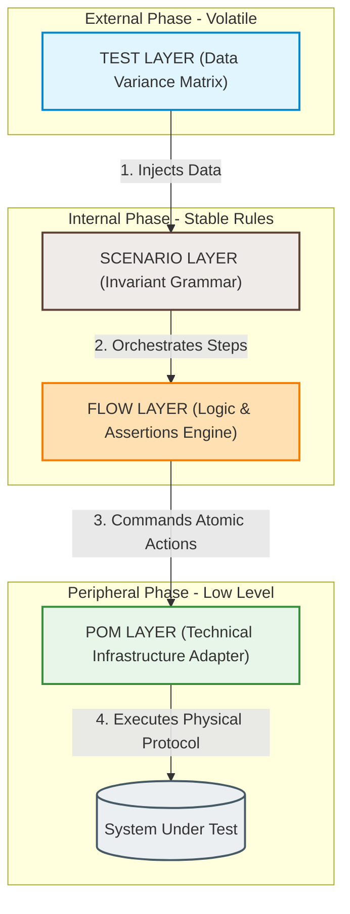

# Layered Keyword-Driven Framework (LKDF)
## An Architectural Reference Model for Scalable Enterprise Test Automation
**Version 1.0**

**Date:** Jun 01, 2026

---
### Abstract
*With the continuous acceleration of deployment cycles in modern software engineering, test automation suites frequently suffer from technical debt, flaky executions, and exponential maintenance costs. Traditional testing frameworks provide operational primitives but lack strict architectural guidelines, leading to tightly coupled test code. This whitepaper introduces the Layered Keyword-Driven Framework (LKDF), an enterprise-grade architectural reference model that enforces a strict, downward unidirectional separation of concerns across four discrete layers: Test, Scenario, Flow, and Page Object Model (POM). By mathematically flattening the technical debt growth from a geometric curve to an asymptotic linear trend $O(N)$, LKDF isolates system volatility, ensures rigorous requirement traceability, and enables long-term maintainability for large-scale corporate quality assurance operations.*

---

## 1. Introduction and Executive Summary

### 1.1 The Challenge of Modern Automation at Scale
In contemporary software engineering ecosystems, the adoption of Continuous Integration and Continuous Delivery (CI/CD) pipelines imposes a strict need for ultra-frequent and deterministic test executions. As the product scales, the absence of a structured approach causes the test automation code to degrade at an accelerated rate. In enterprise environments, the increasing volume of test suites frequently results in a maintainability crisis, where the time spent sorting through false positives and fixing broken scripts surpasses the time dedicated to validating new product increments.

### 1.2 Limitations of Traditional Frameworks
The off-the-shelf tools and automation frameworks predominant in the quality assurance market primarily operate as technical execution engines and imperative automation tools. By providing operational primitives (such as click emitters, field inputs, and HTTP request capturers), these tools transfer the responsibility for architectural design to the engineer. In the absence of rigid guidelines, the systematic outcome is the emergence of informal frameworks marked by:
* **Tight Coupling:** Business validation logic intrinsically mixed with User Interface (UI) selectors or API contracts.
* **Cyclic Complexity:** Duplicated scenarios rewriting identical steps with minor variations, leading to massive code replication.
* **Domain Dilution:** Excessively technical code that obscures the actual functional intent of the use case, preventing audits by stakeholders and business analysts.

### 1.3 The LKDF Proposal as a Layered Architecture
To mitigate entropy in this scenario, this document proposes the **Layered Keyword-Driven Framework (LKDF)**. The LKDF transcends the concept of an automation utility to establish itself as an Industrial Reference Architecture based on a rigid and unidirectional Separation of Concerns (SoC). 

While the traditional model of linear scripts suffers from a geometric complexity accumulation $O(N^2)$ due to the duplication of logic and selectors, LKDF flattens the maintenance curve. The growth rate of maintenance complexity in relation to the volume of tests ($N$) is mathematically expressed as:

$$f(N) = O(1)_{\text{POM}} + O(1)_{\text{FLOW}} + O(0)_{\text{TEST}} \implies \lim_{N \to \infty} \frac{d(\text{Cost})}{dN} = c$$

Where $c$ represents a predictable, linear, and asymptotic marginal effort constant. The core of the framework lies in the surgical division of automation into four discrete and isolated dimensions:

* **Data (TEST Layer):** A strictly stateless layer dedicated to the ingestion and parameterization of immutable data matrices (*Data-Driven Engine*).
* **Structure (SCENARIO Layer):** A purely declarative and grammatical layer that dictates the macro sequencing and composition of the user journey using abstract keywords, completely devoid of conditional logic or assertions.
* **Logic (FLOW Layer):** Acting as the *Application Flow Layer*, it serves as the central business engine of the framework, where functional rules and acceptance criteria validations (*business assertions*) are operationalized.
* **Technical Execution (POM Layer):** A peripheral layer operating as an *Adapter Pattern*, responsible for isolating the technical infrastructure (such as Web/Mobile locators, HTTP API contracts, or database queries) from the higher layers.

### Central Objective
The primary goal of the LKDF is to **elevate test automation to the level of structured, governable, and scalable Software Engineering**. By isolating the vectors of change within the system under test, the architecture replaces the exponential growth of maintenance costs with a linear and predictable expansion model, guaranteeing the long-term viability of enterprise quality strategies.

---

## 2. Context, Industry Challenges, and Motivation

### 2.1 The Problem in the Quality Engineering Industry
The acceleration of the Software Development Life Cycle (SDLC) driven by agile methodologies and DevOps practices has transformed test automation into a mandatory requirement for the viability of any product. However, the technology industry faces a silent crisis in the efficiency of its automated test suites. The fundamental mistake lies in treating test development as a secondary activity consisting of writing procedural "scripts," rather than developing an actual software system.

This ecosystem generates a critical scenario characterized by:
* **Uncontrolled Growth of Test Scripts:** As new features are delivered, the volume of test files grows in a disordered and ungoverned manner. Without a clear design pattern, each new test case tends to be written from scratch, resulting in massive, un-auditable codebases.
* **Low Code Reusability:** The absence of business abstractions causes identical operational blocks of code (such as authentication flows, form inputs, and menu navigation) to be duplicated exhaustively across multiple files.
* **High Maintenance Cost:** Any subtle modification in the software under test creates a catastrophic domino effect across the automation suite. Minor technical changes require engineers to spend days manually hunting down and fixing hundreds of code snippets scattered across the repository.
* **Premature Coupling with the User Interface (UI):** Traditional scripts directly bind the intent of the test to the physical elements and screen selectors of the application. This lack of isolation leaves the test hostage to front-end volatility.
* **Absence of Formal Architecture in QA Automation:** While development teams apply consolidated patterns (such as Clean Architecture, Hexagonal, and DDD) to shield production software, test automation projects continue to be treated empirically, informally, and without structural governance.

### 2.2 Common Degradation Symptoms (Technical Debt)
The lack of a solid architectural foundation manifests through clear technical debt symptoms that impact business revenue and delivery velocity:
* **Flaky Tests:** The most destructive symptom in modern automation. Tests that pass or fail intermittently without any changes being made to the application code. This phenomenon is induced by mixing business assertions with the rendering times of technical UI elements.
* **Chronic Logic Duplication:** Because off-the-shelf tools do not enforce a separation of concerns, the logic for orchestrating journeys and functional validation rules end up rewritten under different formats, inflating the Total Cost of Ownership (TCO) of the code.
* **Unstable CI/CD Pipelines:** The test suite becomes a bottleneck delaying production deployments. Pipelines constantly fail due to automation instabilities, destroying the development team's trust in the reported results.
* **Critical Difficulty in Scaling QA Teams:** In chaotic structures, onboarding new engineers becomes highly complex. Teams spend roughly 80% of their useful time performing corrective maintenance on legacy scripts (reactive approach) and only 20% creating new test coverage (proactive approach).

### 2.3 The Architectural Gap in the Market
The industry's core problem is not a shortage of tools. Modern and robust execution engines (such as Playwright, Selenium, Cypress, and Robot Framework) are widely accessible and excellently fulfill the role of interacting with browsers, emulating HTTP requests, and manipulating databases.

The actual gap lies in the fact that **these tools operate at the infrastructure and technical execution layer; they do not provide an architectural design model**. They offer operational primitives but do not dictate the rules of where each concept should reside. 

In the vast majority of market implementations, there is a collision and overlap of concepts where no formal separation exists between:
* **Structure (SCENARIO):** The abstract and declarative mapping of the user journey.
* **Logic (FLOW):** The engine that processes business rules and functional application assertions.
* **Data (TEST):** The matrices of variables, parameters, and payloads that alter test behavior.
* **Technical Execution (POM):** The isolation of selectors, screen IDs, and technical communication drivers.

The LKDF was specifically engineered to fill this gap, establishing a strict, standardized, and immutable separation between these four dimensions, bringing governance and software engineering maturity to the heart of test automation.

---

## 3. Theoretical Foundations

The LKDF architecture was not developed empirically or through operational intuition. It was formalized by combining and adapting consolidated pillars of classic Software Engineering, international quality standards, and test system design patterns. This section details the theoretical bases that sustain the integrity and resilience of the framework.

### 3.1 Core Software Engineering

#### Separation of Concerns (SoC)
Postulated by Edsger W. Dijkstra, the principle of *Separation of Concerns* is the cornerstone of the LKDF. The concept dictates that a software system must be divided into distinct sections, such that each section addresses a specific and isolated responsibility. In the automation ecosystem, this means that fluctuations in user interface elements (a technical concern) must never impact transactional flow definitions (a business concern) or the dataset (a parameterization concern).

#### Clean Architecture and the Dependency Rule
As advocated by Robert C. Martin ("Uncle Bob"), clean architecture organizes software into concentric circles of responsibility. The fundamental and absolute rule is the **Dependency Rule**: code dependencies (expressed by `import` statements or injections) must only point inwards, toward higher levels of abstraction and business policies. 

The LKDF applies this concept linearly, adapting it into a downward acyclic flow:
* The external and peripheral layers operate as delivery mechanisms, data providers, and infrastructure drivers (`TEST` and `POM`).
* The internal layers safeguard the stability of the functional rules of the application and use cases (`FLOW` e `SCENARIO`).

#### SOLID Principles Applied to Automation
The flexibility of the LKDF is a direct result of applying SOLID principles to the test codebase, with an emphasis on:
* **Single Responsibility Principle (SRP):** Each class or file within the framework has a single reason to change. A class in the `POM` layer changes only if there is a structural refactoring in the application's front-end or API. A class in the `FLOW` layer changes only if the product's business rules are altered by the business team.
* **Dependency Inversion Principle (DIP):** High-level modules (scenarios and flows) do not depend on low-level modules (specific drivers). They interact through abstractions and well-defined functional methods.

### 3.2 Requirements Engineering

#### ISO/IEC/IEEE 29148:2018
This international standard dictates the requirements and processes for systems and software requirements engineering throughout the entire product lifecycle. It defines the rigor necessary to structure functional and non-functional requirements, ensuring that the engineered software accurately reflects business needs.

#### Requirements Traceability $\rightarrow$ Tests
One of the largest bottlenecks in enterprise quality audits is proving whether all criteria established by Requirements Analysts and Product Owners (POs) were actually validated. The LKDF resolves this gap by implementing a physical and logical link of indirect traceability:

$$\text{Functional Requirement (ISO 29148)} \longrightarrow \text{Symbolic Dataset (TEST)} \longrightarrow \text{Declarative Journey (SCENARIO)} \longrightarrow \text{Rule Validation (FLOW)}$$

The structure of the LKDF allows each node of a requirement to be mirrored in code. If a requirement is modified, the software engineer in test can instantly identify the exact point within the layered architecture that needs to be updated to maintain regulatory compliance.

### 3.3 Software Quality

#### ISO/IEC 25010:2011 (Systems and Software Quality Model)
The ISO/IEC 25010 standard replaced the old ISO 9126 and establishes models for evaluating software product quality through specific characteristics. The LKDF focuses on the continuous improvement of vital sub-characteristics within automation code:

* **Maintainability (Modularity and Analyzability):** Decomposing the code into four watertight layers drastically reduces the project's cyclic complexity. The Mean Time to Repair (MTTR) a broken test is reduced to minutes because the root cause of the issue is easily isolated within its respective layer.
* **Reliability (Fault Tolerance and Maturity):** By banning logical and conditional code from strictly executing layers (such as `POM` and `SCENARIO`), the framework eliminates unstable determinism (*flakiness*). Tests become repeatable and trustworthy in continuous integration environments.
* **Portability (Replaceability):** Should the enterprise decide to alter the underlying execution technology (for instance, migrating a legacy Selenium suite to Playwright for performance reasons), the business layer (`FLOW`), the structural layer (`SCENARIO`), and the dataset (`TEST`) remain completely intact. The technical change is 100% contained within the `POM` layer, mitigating the risks and costs of automation technology migration.

### 3.4 Test Automation Patterns
The LKDF achieves a harmonious fusion of four of the most recognized patterns in test engineering, leveraging their individual strengths while eliminating their historic weaknesses when implemented in isolation:
* **Page Object Model (POM):** Introduced by Martin Fowler, this pattern dictates that pages or components of an application should be represented as software objects that encapsulate their selectors and interactions. The LKDF adopts POM at its base layer but with rigid restrictions: the POM is strictly devoid of business rules or assertions, operating as a "dumb" execution mechanism.
* **Keyword-Driven Testing (KDT):** An approach that separates test logic from actual scripts by using human-readable keywords to represent system actions. The LKDF utilizes this strategy to compose journeys in the `SCENARIO` layer, converting actions into abstract blocks of high readability.
* **Data-Driven Testing (DDT):** A pattern where test scripts execute iteratively by consuming data from external matrices (JSON, YAML, CSV). The LKDF isolates this dynamic entirely within the `TEST` layer, allowing the immutable reusability of the same logical skeleton with endless data variations.
* **Behavior-Driven Development (BDD / Gherkin) - Partial and Adapted:** BDD promotes technical collaboration through scenarios written in structured natural language (Given/When/Then). The LKDF inherits the philosophy of BDD to structure the readability and semantics of the `SCENARIO` layer. However, it removes the complexity and fragility of traditional Cucumber/SpecFlow regex interpreters by mapping the declarative journey directly to native, strongly-typed, and highly performant code methods.

---

## 4. LKDF Architectural Overview

The LKDF architecture was designed on the premise that the stability of an enterprise automation suite depends on the predictability of its data and control flow. Instead of creating linear scripts where a single class handles data, screen navigation, and assertions, the LKDF divides the testing system into four concentric and strictly ordered architectural domains.

### 4.1 Conceptual Pipeline and Flow Topology
Control flow and technical execution within the LKDF operate in a strictly downward, unidirectional manner (*Strict Top-Down Execution*). The system's call graph is acyclic, meaning that backward execution calls or layer bypassing are expressly prohibited by governance.



The execution pipeline topology follows the ordering chain below:

$$\text{[ TEST LAYER ]} \longrightarrow \text{[ SCENARIO LAYER ]} \longrightarrow \text{[ FLOW LAYER ]} \longrightarrow \text{[ POM LAYER ]} \longrightarrow \text{[ SYSTEM UNDER TEST (SUT) ]}$$

In this structure, a layer possesses the technical visibility and authority to invoke only the methods exposed by the layer immediately below it. This shielding ensures that no infrastructure change propagates side effects upstream to the top of the execution chain.

### 4.2 Mental Model and Functional Abstraction

To facilitate governance, design, and daily development by engineering teams, the LKDF adopts a mental model based on clear semantic assignments for each layer. This model converts systemic complexity into four intuitive concepts:

* **TEST = Variation:** Represents the volatile dimension of data. Its role is to define the different boundary conditions, inputs, payloads, and expected outputs (data matrix) that will guide an execution.
* **SCENARIO = Structure:** Represents the grammatical dimension and the macro order of the journey. Its role is to orchestrate the sequence of high-level functional steps that compose the use case, operating in an invariant manner.
* **FLOW = Logic:** Represents the algorithmic and business dimension. Its role is to process the automation's decision-making, evaluate system states, and apply engineering assertions in compliance with the application's functional business rules.
* **POM = Technical Execution:** Represents the infrastructure and technological coupling dimension. Its role is to translate logical business demands into physical imperative actions against the target under test (whether interacting with HTML elements, triggering gRPC/REST requests, or inserting data into SQL tables).

### 4.3 Fundamental Property: Change Isomorphism

The most critical engineering property of the LKDF is the **bijective relationship between a layer's responsibility and its type of change**, also known as the Principle of Change Isolation.

Each layer holds exactly one single functional responsibility and, consequently, is affected by only one type of change trigger originating from the product's development lifecycle:

```text
  +----------------+-------------------------------+----------------------------------+
  |   LKDF LAYER   |      SINGLE RESPONSIBILITY    |       SINGLE CHANGE TRIGGER      |
  +----------------+-------------------------------+----------------------------------+
  |  TEST          |  Parameterize execution       |  New edge cases or               |
  |                |  (Data-Driven Binding)        |  changes to the test dataset.    |
  +----------------+-------------------------------+----------------------------------+
  |  SCENARIO      |  Orchestrate user journey     |  Changes to the macro process of |
  |                |  ordering                     |  the user experience (UX).       |
  +----------------+-------------------------------+----------------------------------+
  |  FLOW          |  Validate application rules   |  Alterations to business rules,  |
  |                |  and functional assertions    |  calculations, or policies.      |
  +----------------+-------------------------------+----------------------------------+
  |  POM           |  Isolate selectors and driver |  SUT code refactoring,           |
  |                |  communication mechanics      |  layout changes, or stack shifts.|
  +----------------+-------------------------------+----------------------------------+

```

---

## 5. Detailed Definition of Architectural Layers

To ensure that the separation of concerns is not merely a theoretical guideline but a physical constraint in the code, the LKDF rigorously defines the boundaries of each of its four layers through three vectors: Purpose, Responsibilities, and Operational Properties.

### 5.1 TEST LAYER (Data Ingestion Layer)

* **A. Purpose:** To serve as the instantiation and environment variation layer. It is the official entry point for the Test Runner and the place where the dynamic runtime binding between the dataset and the structural test skeleton is established.
* **B. Responsibilities:** Centralize and load data matrices, environment configuration files (Staging, Production, Sandbox), and payloads, providing native support for multiple iterative executions (*Data-Driven Testing*).
* **C. Operational Properties:** Strictly stateless, purely declarative, and completely independent of logic. The use of loops or conditional structures (`if/else`) is strictly forbidden at this level.

### 5.2 SCENARIO LAYER (Structural Layer)

* **A. Purpose:** To provide a pure, sequential, and human-readable grammatical representation of the macro journey executed by the end user or the system.
* **B. Responsibilities:** Determine the exact chronological order in which business keywords are invoked, translating acceptance criteria into a stable logical chain.
* **C. Operational Properties:** Linear and devoid of flow processing logic. It is completely data-agnostic, receiving symbolic references and passing them along without reading or inspecting their values.

### 5.3 FLOW LAYER (Application Flow / Business Logic Engine)

* **A. Purpose:** To operationalize the automation's business rules, acting as a Service Layer or Facade that translates abstract functional intents into coordinated operational steps.
* **B. Responsibilities:** Code corporate policies (calculations, eligibilities), orchestrate multiple Page Objects simultaneously or sequentially, and house the functional engineering assertions (*business assertions*).
* **C. Operational Properties:** Intelligent and dynamic. It is the only location within the framework where algorithmic decision structures and exception handling are permitted. It is entirely agnostic to datasets and scenarios, maximizing global reusability.

### 5.4 POM LAYER (Technical Abstraction / Infrastructure Layer)

* **A. Purpose:** To operate as a peripheral technical infrastructure adapter (*Adapter Pattern*). Its exclusive goal is to encapsulate implementation details and the physical mechanics of communication with the SUT, shielding the framework against layout and tooling fluctuations.
* **B. Responsibilities:** Centralize interface locators (CSS, XPath), manage physical automation driver commands, model HTTP contract payloads (APIs), and structure persistence queries (Databases).
* **C. Operational Properties:** Pure and atomic technical execution. It is devoid of any understanding regarding transactional values or business rules, acting strictly as an on-demand command executor.

---

## 6. Execution Model and Runtime Lifecycle

### 6.1 Execution Pipeline

When the automation suite is initiated by the Test Runner, the technical control flow traverses the layers in a strictly downward fashion. Each lifecycle stage features a specific activation trigger and execution responsibility before delegating control to the lower level:

$$\text{[ TEST LAYER ]} \longrightarrow \text{[ SCENARIO LAYER ]} \longrightarrow \text{[ FLOW LAYER ]} \longrightarrow \text{[ POM LAYER ]} \longrightarrow \text{[ SYSTEM UNDER TEST (SUT) ]}$$

1. **Dataset Ingestion (Load Phase):** The `TEST` layer script reads and allocates immutable data dictionaries into memory.
2. **Scenario Selection (Structural Resolution Phase):** The runner invokes the corresponding `SCENARIO`, injecting the collected data mass as a generic and immutable argument.
3. **Flow Execution (Business Orchestration Phase):** The scenario breaks down the journey by calling `FLOW` layer methods in the correct chronological order. The flow captures the parameters, processes algorithmic decisions, and prepares assertions.
4. **POM Interactions (Imperative Translation Phase):** The `FLOW` layer triggers atomic functions in the `POM` layer. The page object translates business requests into low-level driver commands (clicks, fills, typing).
5. **System Under Test (Physical Impact Phase):** Commands are physically executed against the target system (SUT), generating reactions that traverse back up the bus for final validation.

### 6.2 Data Binding Mechanism and the Coercion Barrier

The major challenge for traditional keyword-driven architectures is scope leakage, where keywords must understand data details to function. The LKDF solves this vulnerability by implementing a **Strict Contract-Based Unidirectional Data Binding** model accompanied by a Coercion Barrier.

```text
[ TEST ] ------------> [ SCENARIO ] -----------------------> | COERCION BARRIER | -----------------------> [ FLOW ] ------------> [ POM ]
(Generic Dictionary)    (Pass-through / No Reading)          | Typed Signature  |                         (Primitive Args)         (Atomic Actions)
                                                             | (STRICT CONTRACT)|

```

* **A. TEST Layer (Data Provider):** Encapsulates data into open key-value structures (dictionaries or JSON objects). It does not interpret keys; it merely pushes the information block down to the structural level.
* **B. SCENARIO Layer (Data Pass-Through):** Acts as a clean pass-through channel. It receives the raw dictionary from the upper layer but **is strictly forbidden from reading, altering, or injecting hardcoded keys** into its instructions. It acts purely as the carrier of the data package.
* **C. FLOW Layer (Coercion Barrier and Consumption):** Serves as the final consumer of the information. Methods within the flow layer reject generic objects or open dictionaries; they demand **explicit, typed parameters within their method signatures** (e.g., `execute_transfer(target_account: str, amount: float)`).

This coercion at the entry boundary of the `FLOW` layer creates an architectural safeguard: it enforces precise documentation of test dependencies and guarantees that the `POM` layer receives only clean, primitive variables, keeping the infrastructure fully isolated from complex data contracts.

---

## 7. Responsibility Matrix and Code Governance

To ensure the longevity of the LKDF architecture and prevent the structural degradation common in large-scale projects under deadline pressures, an unequivocal Responsibility Matrix is established. This matrix operates as a software design contract that determines the scope of each layer, the limits of its technical authority, and the unique factor that legitimizes altering its corresponding files.

### 7.1 Scope Matrix and Change Vectors

| Layer | Responsibility Type | Abstraction Mechanism | Allowed Change Type (Trigger) | What it CANNOT Contain (Rigid Restriction) |
| :--- | :--- | :--- | :--- | :--- |
| **TEST** | Data Ingestion | Parameterization and Runner Binding (Pytest, JUnit, etc.) | **Dataset Changes:**<br><br>Inclusion of new test values, new user profiles, or environment keys. | Algorithmic logic, decision structures (if/else), loop blocks, functional assertions, or UI screen selectors. |
| **SCENARIO** | Grammatical Orchestration (Structural Layer) | Declarative Methods based on Keywords. | **Workflow Changes:**<br><br>Changes to the user's macro journey or chronological ordering of system transactions. | Hardcoded data, business assertions, functional exception handling, or direct driver manipulation. |
| **FLOW** | Business Intelligence (Service Layer / Facade) | Logical orchestration and typed parameter processing. | **Business Rule Changes:**<br><br>Alterations to acceptance criteria, tax rules, transactional calculations, or conditional flows. | Interface selectors (XPath, CSS), API endpoint URIs, or physical database connections and queries. |
| **POM** | Infrastructure Isolation (Adapter Pattern) | Imperative and atomic abstraction of SUT components. | **Infrastructure Changes:**<br><br>Front-end code refactoring, layout alterations, API schema changes, or database migrations. | Cross-functional validations, logical business assertions, or decision-making algorithmic intelligence. |


---

### 7.2 Validation Guidelines for Code Review

The Responsibility Matrix must be actively utilized by Tech Leads and Architects during the Pull Request review process. Any deviation from the rules established above constitutes an architectural violation (scope leakage) and must result in the immediate rejection of the code increment.

The three fundamental questions to audit LKDF-based code are:
1. **Is the POM making business decisions?** If a Page Object class contains conditional logic based on a corporate business rule, the code is incorrect. The POM must only expose raw, imperative actions.
2. **Does the Scenario know the actual data?** If the scenario file displays specific test strings (such as mock SSNs/CPFs, specific emails, or fixed financial values), the isolation has been breached. These values must reside strictly within the `TEST` layer.
3. **Is the Flow coupled to the technology?** If the flow layer references native automation commands (such as `driver.find_element` or direct HTTP client instances), the infrastructure layer has failed to conceal the execution technology.

---

## 8. Architectural Principles and Design Axioms

The long-term stability and immunity to systemic degradation of the LKDF are guaranteed by adherence to four fundamental architectural principles. These principles function as mathematical axioms: they are absolute rules that eliminate ambiguity when writing automation code and shield the ecosystem against technical debt.

### 8.1 Dependency Rule (The Unidirectional Dependency Rule)
The LKDF architecture enforces that code dependencies must point strictly in a linear, downward direction. No layer may possess visibility, knowledge, or structural dependency (whether through inheritance, instantiation, or import coupling) on any layer positioned above it or by bypassing immediate levels.

* **Permitted Coupling Flow:** `TEST` $\rightarrow$ `SCENARIO` $\rightarrow$ `FLOW` $\rightarrow$ `POM`.
* **Invariant Restriction:** Cyclic coupling or level bypassing is strictly prohibited. The `TEST` layer can never instantiate a `POM` class directly. The `POM` layer cannot return types or data that require logical interpretation by the `SCENARIO` layer.

By restricting coupling traffic to a unidirectional channel, we eliminate the emergence of cascading side effects. An infrastructure refactoring at the base of the testing system dies at its respective abstraction interface, preventing error propagation to the top of the execution pyramid.

### 8.2 Strict Separation of Concerns
This principle establishes that there are no gray areas or scope intersections within the framework. Each engineering responsibility belongs to a unique, watertight geographical domain, eliminating any conceptual overlap.

* **Monopoly of Intelligence:** Algorithmic intelligence and computational logic belong exclusively to the `FLOW` layer. No line of operational or conditional logic may reside outside of it.
* **Infrastructure Isolation:** The physical manipulation of the system under test belongs exclusively to the `POM` layer. No external calls from the flow or scenario layer should know technical elements of the communication protocol (HTTP, HTML DOM, or TCP).

If a behavior or validation can be interpreted as a "business rule," it must be pushed down to the `FLOW` layer. If it is purely a physical object mapping, it belongs to the `POM`. This rigid separation eradicates design confusion and standardizes repository organization.

### 8.3 Immutability of Structure
The principle of immutability determines that the assignments and operational behavior of a layer cannot be modified or corrupted by external factors or development conveniences. The structure of each level is static and preserves its fundamental characteristics:

* **SCENARIO contains no logic:** The scenario acts purely as an invariant musical score or grammatical script. It dictates the order but does not alter the flow based on conditional decisions.
* **TEST contains no structure:** The test script limits itself to a trigger and state injection role. It does not design steps, group keywords, or define the journey; it simply feeds the existing skeleton.
* **FLOW contains no data:** The flow layer implements pure functions that operate on abstract parameters passed by reference. It does not store static, hardcoded strings, access credentials, or validation payloads.

This immutability ensures massive code reusability: the same business logical structure (`FLOW`) and the same journey (`SCENARIO`) can be reused endlessly across different data variations (`TEST`), without one file interfering with the integrity of another.

### 8.4 Single Responsibility per Layer
A direct adaptation of the SOLID principle to the macro software architecture level. Each layer of the LKDF has **exactly one type of engineering responsibility** and, consequently, inherits a single maintenance and change vector.

```text
               +-------------------------------------------+
               |                 TEST LAYER                |
               |      Responsibility: Data / Variance      |
               +---------------------+---------------------+
                                     |
                                     ▼
               +-------------------------------------------+
               |               SCENARIO LAYER              |
               |     Responsibility: Order / Structure     |
               +---------------------+---------------------+
                                     |
                                     ▼
               +-------------------------------------------+
               |                 FLOW LAYER                |
               |       Responsibility: Rule / Logic        |
               +---------------------+---------------------+
                                     |
                                     ▼
               +-------------------------------------------+
               |                 POM LAYER                 |
               |     Responsibility: Infra / Execution     |
               +-------------------------------------------+

```

This encapsulation ensures that the architecture is highly analyzable. If a test breaks because the front-end layout changed, the responsibility lies solely within the POM layer. If the test breaks because the interest calculation rule changed, the responsibility lies solely within the FLOW layer. The developer knows exactly which file to open based on the failure symptom, drastically reducing the Mean Time to Repair (MTTR).

---

## 9. Scalability and Computational Complexity Analysis

The economic and operational efficiency of a test software architecture is measured by its capacity to absorb product growth without demanding a proportional or geometric increase in engineering effort. This section analytically demonstrates how the LKDF governs code growth and mitigates systemic entropy in large-scale Enterprise ecosystems.

### 9.1 Structured and Predictable Growth Model

In traditional, unstructured approaches, expanding a test suite generates chaotic growth, where new files duplicate existing logic and create multiple points of failure. The LKDF solves this problem by mapping orthogonal and predictable expansion paths. The development of new tests follows a scope-driven growth model:

* **Adding Functional Variants $\rightarrow$ TEST:** When the goal is to expand test coverage by including new edge cases, exception paths, different user profiles, or value combinations, the effort is limited to adding new immutable data records in the `TEST` layer. The engineering cost for new code is **zero ($O(0)$)**, as it leverages the existing structural and logical skeleton.
* **Adding New Business Rules $\rightarrow$ FLOW:** When the system under test gains a new corporate policy, an unprecedented validation, or a change in calculation rules, the alteration remains strictly contained within the creation or modification of methods inside the `FLOW` layer. No other layer suffers collateral impacts.
* **Adding New User Flows $\rightarrow$ SCENARIO:** When a new macro journey or structural use case is introduced into the product (e.g., a new checkout method or an unprecedented transactional flow), the engineer operates exclusively within the `SCENARIO` layer, combining abstract keywords already available in the flow layer.
* **Modernization and Platform Changes $\rightarrow$ POM:** When the system under test undergoes visual modifications, front-end layout refactoring, graphic component migrations, or updates to technical API contracts and database schemas, the maintenance effort is restricted to the atomic adjustment of selectors and imperative methods inside the `POM` layer.

### 9.2 Asymptotic Complexity Analysis (Big-O Notation)

To scientifically validate the resilience of the LKDF, the accumulated effort of maintenance and code writing is evaluated using asymptotic Big-O notation, comparing it with traditional models based on linear or coupled scripts.

#### A. The Traditional Model (Geometric Coupling)

In a conventional automation suite, business logic, data, and technical selectors share the same physical scope. As the number of test scenarios ($N$) increases and the number of interface elements and system rules ($M$) expands, the probability of a technical change breaking multiple scripts grows geometrically.

Corrective maintenance effort and the Total Cost of Ownership (TCO) scale quadratically:

$$\text{Complexity}_{\text{Traditional}} = O(N \times M) \approx O(N^2)$$

This growth curve explains why traditional automation projects invariably become unsustainable over time: the team ends up spending more time fixing legacy tests than creating coverage for new features.

#### B. The LKDF Model (Linear and Constant Isolation)

By surgically isolating the vectors of change into independent layers, the LKDF breaks the geometric interdependence between scenarios and infrastructure.

* **Maintenance due to Interface Changes (Layout):** When a massive UI change occurs in the system under test, the refactoring impact is restricted solely to the `POM` layer. The number of required alterations is independent of the number of test scenarios in the suite. Therefore, the technical maintenance effort behaves constantly:

$$\text{Complexity}_{\text{UI Refactoring}} = O(1)$$

* **Coverage Expansion via Datasets:** When the ecosystem requires testing hundreds of new functional permutations, the effort is limited to feeding data matrices into the `TEST` layer. Since there is no writing of new programming logic or new Page Objects, the algorithmic maintenance cost is null:

$$\text{Complexity}_{\text{Data Expansion}} = O(0)$$

* **Overall Suite Growth:** When complete new business journeys need to be integrated, the addition of code within the `SCENARIO` and `FLOW` layers follows a strictly modular progression, streamlined by the massive reuse of keywords. The growth of engineering costs abandons the exponential curve and stabilizes into a predictable linear behavior:

$$\text{Complexity}_{\text{LKDF}} = O(N)$$

This asymptotic efficiency gain guarantees the high scalability of the framework, allowing large corporations to maintain suites with thousands of automated tests running on stable CI/CD pipelines with minimal and predictable operational costs.

---

## 10. Conceptual Implementation Reference (Login System)

To demonstrate the technical viability and physical separation of concepts advocated by the LKDF, this section presents a reference implementation in Python for a classic corporate authentication system. The example illustrates how the flow transitions between the four layers in a decoupled and typed manner.

### 10.1 Layer 4: POM LAYER (Technical Abstraction)

The class below encapsulates solely the mechanics of infrastructure and interaction with the graphical elements of the login page. It operates imperatively and is devoid of business intelligence or functional assertions.

```python
class LoginPagePOM:
    """
    Responsibility: Encapsulate selectors and physical Driver commands.
    Properties: No logic, no business rules, pure technical execution.
    """
    def __init__(self, automation_driver):
        self.driver = automation_driver
        self.username_field = "css=input[name='username']"
        self.password_field = "css=input[name='password']"
        self.submit_button  = "id=btn-login"
        self.error_message  = "class=alert-danger"

    def fill_username_field(self, username: str):
        self.driver.clear_and_type(self.username_field, username)

    def fill_password_field(self, password: str):
        self.driver.clear_and_type(self.password_field, password)

    def trigger_authentication_click(self):
        self.driver.click(self.submit_button)

    def capture_authentication_error_text(self) -> str:
        return self.driver.get_text(self.error_message)

```

### 10.2 Layer 3: FLOW LAYER (Business Logic Engine)

The flow layer orchestrates the atomic methods exposed by the POM and implements the algorithmic logic of the automation, hosting the software engineering assertions (*business assertions*).

```python
class LoginFlow:
    """
    Responsibility: Implement functional logic and behavior assertions.
    Properties: Contains logic, dataset-agnostic, and scenario-agnostic.
    """
    def __init__(self, login_pom: LoginPagePOM):
        self.login_pom = login_pom

    def execute_authentication_flow(self, username: str, password: str):
        # Clean imperative orchestration
        self.login_pom.fill_username_field(username)
        self.login_pom.fill_password_field(password)
        self.login_pom.trigger_authentication_click()

    def validate_expected_lockout_message(self, expected_message: str):
        obtained_message = self.login_pom.capture_authentication_error_text()
        
        # Corporate business assertion centralized in the correct layer
        if expected_message not in obtained_message:
            raise AssertionError(
                f"Business validation failure. Expected: '{expected_message}', "
                f"but the system returned: '{obtained_message}'"
            )

```

### 10.3 Layer 2: SCENARIO LAYER (Structural Layer)

The scenario acts as a declarative grammatical skeleton that dictates the order of the use case. It receives the data package and distributes it to the competent flows without inspecting or manipulating it.

```python
class AuthenticationScenario:
    """
    Responsibility: Define the invariant structural order of the journey.
    Properties: No logic, no hardcoded data, no decision-making.
    """
    def __init__(self, login_flow: LoginFlow):
        self.login_flow = login_flow

    def login_standard_flow(self, dataset: dict):
        """Orchestrates the standard journey sequence passing parameters by reference."""
        self.login_flow.execute_authentication_flow(
            username=dataset["username_input"],
            password=dataset["password_input"]
        )

```

### 10.4 Layer 1: TEST LAYER (Runtime Ingestion)

The test layer acts as the execution trigger controlled by the Test Runner. It loads the immutable data matrices and starts the top-down pipeline of the architecture.

```python
import pytest

# Simulation fixture for the technical automation engine
@pytest.fixture
def driver_instance():
    return MockDriverEngine()

# ------------------------------------------------------------------------------
# Variant 1: Success Flow
# ------------------------------------------------------------------------------
def test_authentication_corporate_success(driver_instance):
    # Immutable Data Ingestion (TEST)
    success_dataset = {
        "username_input": "user.enterprise@company.com",
        "password_input": "SecurePassword123!"
    }
    
    # Assembly of the LKDF downward acyclic dependency tree
    pom_layer      = LoginPagePOM(driver_instance)
    flow_layer     = LoginFlow(pom_layer)
    scenario_layer = AuthenticationScenario(flow_layer)
    
    # Deterministic trigger of the scenario structure
    scenario_layer.login_standard_flow(success_dataset)
    
    # Final runtime state assertion managed by the runner
    assert driver_instance.get_current_url() == "[https://company.com/dashboard](https://company.com/dashboard)"

# ------------------------------------------------------------------------------
# Variant 2: Exception Flow (Locked User)
# ------------------------------------------------------------------------------
def test_authentication_rejected_locked_user(driver_instance):
    # Immutable Data Ingestion (TEST)
    lockout_dataset = {
        "username_input": "suspicious.user@company.com",
        "password_input": "AnyPassword",
        "error_feedback": "Access blocked due to multiple incorrect attempts."
    }
    
    pom_layer      = LoginPagePOM(driver_instance)
    flow_layer     = LoginFlow(pom_layer)
    scenario_layer = AuthenticationScenario(flow_layer)
    
    # Execution of the SAME structural scenario skeleton with exception data
    scenario_layer.login_standard_flow(lockout_dataset)
    
    # Invocation of the logical validation hosted in the corresponding FLOW
    flow_layer.validate_expected_lockout_message(lockout_dataset["error_feedback"])

```

---

## 11. Comparison Between Traditional Models and the LKDF Architecture

Evaluating the technical viability of a test architecture requires mapping trade-offs against conventional development models. This section confronts the characteristics of script-based automation with the structural properties introduced by the LKDF.

### 11.1 Technical Comparison Matrix

| Engineering Dimension | Traditional Script-Based Automation | Structured LKDF Approach |
| --- | --- | --- |
| **Coupling Level** | **High (Monolithic):** Data, business relational flows, and technical infrastructure selectors cohabit the same file and physical scope. | **Null (Decoupled):** Strict separation into layers through interfaces and strongly typed method signatures. |
| **Modularity & Reuse** | **Low:** Procedurally written code. Identical steps and repetitive journeys are duplicated exhaustively across multiple scripts. | **High (Keyword Composition):** Purely modular components. Business flows are written once and reused by infinite scenarios. |
| **Maintenance Complexity** | **High (Domino Effect):** Simple changes to the UI or a calculation rule require manual and chaotic refactoring across dozens of test files. | **Low (Isolated):** The failure symptom points surgically to the responsible layer. UI changes only affect the POM ($O(1)$). |
| **Data Management** | **Coupled:** Test data inserted via hardcoded strings and fixed values directly within the execution script bodies. | **Isolated (Data-Driven):** External, immutable data mass injected via runtime into the external layer (`TEST`), with zero code effort ($O(0)$). |
| **Stability (Flakiness)** | **Unstable:** Mixing implicit waits, interface selectors, and assertions generates frequent false positives in CI/CD pipelines. | **Deterministic:** Banning logic from operational layers eliminates state concurrency, generating repeatable executions. |
| **Design Philosophy** | **Empirical:** Focused on the rapid delivery of isolated scripts (macros) without concern for code lifecycle and technical debt. | **Architecture-Oriented:** Aligned with classic software patterns (Clean Architecture, GoF) and international quality standards (ISO 25010). |

### 11.2 The Impact on the Lifecycle Cost Curve (SDLC)

In the long run, the divergence between the two models directly reflects on the financial balance and the delivery velocity (Time-to-Market) of product engineering:

1. **In Script-Based Automation:** Maintenance costs grow at a geometric rate. A technical inflection point is reached where the quality team operates in a 100% reactive manner, spending all its useful time fixing broken scripts instead of expanding test coverage for new features.
2. **In LKDF-Based Automation:** The initial investment in architectural design and scaffolding stabilizes the project's evolution cost. Creating new test variants becomes a purely declarative activity of data configuration, freeing Software Engineers in Test (SDETs) to focus on infrastructure resilience and higher-value testing activities.

---

## 12. Limitations, Trade-offs, and Implementation Challenges

No software architecture is a universal silver bullet. The fundamental principle of software engineering is based on the detailed analysis of trade-offs. For the LKDF to deliver its promised linear scalability and maintenance isolation, the organization must be aware of its intrinsic limitations and the operational challenges associated with its adoption.

### 12.1 Steep Initial Learning Curve

Traditional script-based automation possesses a very low technical entry barrier, allowing novice professionals or manual test analysts to write functional automations quickly. The LKDF, conversely, demands advanced maturity in Software Engineering.

* **Technical Prerequisites:** Quality Engineers (SDETs) must master complex Object-Oriented Programming (OOP) concepts, GoF design patterns (such as *Adapter*, *Facade*, and *Strategy*), inversion of control, and dependency injection.
* **Impact on Onboarding:** The time required for a new team member to understand the flow topology and program in compliance with layer restrictions is higher than with conventional frameworks, demanding the implementation of structured mentorship and Pair Programming programs.

### 12.2 Initial Code Overhead (Boilerplate Code)

For extremely simple scenarios, early-stage validation products (MVPs), or applications with short lifecycles, the LKDF presents a disproportionate engineering overhead.

* **Minimum Initialization Effort:** Creating a single simple test case requires the instantiation of files and classes across four distinct levels (`TEST`, `SCENARIO`, `FLOW`, and `POM`). If the application under test is small and rarely changes, the cost of designing and interconnecting these layers may outweigh the benefit of decoupling.
* **Applicability Recommendation:** The LKDF is a solution engineered for Enterprise ecosystems, mission-critical systems, and long-term consolidated software products. It is not recommended for throwaway automation or ultra-short lifecycle testing.

### 12.3 Risk of Degradation due to Discipline Decline (Architectural Erosion)

The greatest enemy of a layered architecture is the loss of technical discipline over time. Under tight delivery deadlines, developers tend to bypass design boundaries.

* **Concept Leakage:** It is common to observe engineers embedding business assertions within the `POM` layer "to save time," or placing hardcoded strings inside the `SCENARIO` layer.
* **Breach of the Dependency Rule:** Minor violations, such as allowing an upper layer to directly access infrastructure primitives by skipping levels, invalidate the entire constant mathematical complexity modeling $O(1)$, reintroducing geometric coupling and flakiness.

### 12.4 Mandatory Need for Automated Governance

Due to the imminent risk of architectural erosion mentioned above, **the LKDF cannot be sustained solely on manuals or verbal agreements**. It mandates the implementation of technological barrier mechanisms (*guardrails*).

* **Static Dependency Linters:** The inclusion of static architecture analysis tools (such as `Import-Linter` in Python or `ArchUnit` in Java/Node ecosystems) integrated directly into the CI/CD pipeline becomes mandatory. These tools must analyze the compilation tree and automatically fail any Pull Request that presents a dependency violation between layers (e.g., an `import` of the POM inside a scenario).

---

## 13. Consolidated Benefits and Return on Investment (ROI)

Implementing the LKDF converts quality engineering efforts into a highly predictable strategic asset. By aligning testing practices with production software design standards, the organization reaps direct benefits that impact everything from daily team operations to executive performance indicators.

### 13.1 Technical and Operational Benefits

* **Resilience and Flakiness Elimination:** By banning algorithmic intelligence and validations from the infrastructure layers (`POM`), the framework isolates race conditions and network latency. The result is a drastic reduction of false positives in continuous integration pipelines.
* **Maximum Code Reusability:** Total decoupling allows a business flow implemented in the `FLOW` layer to be reused by dozens of distinct scenarios. Test engineering stops being a replication activity and becomes a modular composition activity.
* **Maintenance Agility (Reduced MTTR):** The Mean Time to Repair (MTTR) a test decreases significantly. If a visual element changes, the developer alters a single line in the `POM`. If a tax rule is updated, only the corresponding method in the `FLOW` is adjusted. The root cause of the problem is identified and resolved surgically.
* **Technological Independence:** The business layer is completely shielded against underlying execution tools. If the organization decides to migrate the automation engine (e.g., from Selenium to Playwright), the entire investment in data (`TEST`), journeys (`SCENARIO`), and logic (`FLOW`) is preserved. The change remains 100% contained and isolated within the `POM` layer.

### 13.2 Business Impact and Financial Return (ROI)

* **Reduction of the Total Cost of Ownership (TCO):** By stabilizing code complexity growth on a linear scale $O(N)$ instead of a geometric one $O(N^2)$, long-term maintenance costs drop exponentially. The team spends fewer hours on reactive maintenance and more time on proactive coverage.
* **Accelerated Time-to-Market:** With stable and reliable CI/CD pipelines, production deployments are no longer halted by automation instabilities. Product engineering gains velocity and confidence to perform high-frequency deliveries.
* **Team Capacity Optimization:** Senior engineers shift focus to evolving the architecture and creating new logical accelerators (`FLOW`), while business analysts or junior engineers can expand test coverage simply by feeding declarative data matrices (`TEST`), without the need to generate complex lines of code.

### 13.3 Success Metrics Matrix

```text
  +-----------------------------+-----------------------------+-----------------------------+
  |       PROCESS METRIC        |     TRADITIONAL SCENARIO    |      SCENARIO WITH LKDF     |
  +-----------------------------+-----------------------------+-----------------------------+
  | Triage and Repair Time of   | High (Hours or days hunting | Low (Minutes; root cause    |
  | Broken Tests (MTTR)         | the error in the scripts)   | isolated per layer)         |
  +-----------------------------+-----------------------------+-----------------------------+
  | Rate of False Positives in  | High (Unstable pipelines    | Close to Zero (Technical    |
  | the Pipeline (Flakiness)    | that destroy trust)         | determinism in POM/FLOW)    |
  +-----------------------------+-----------------------------+-----------------------------+
  | Scaling Effort for New      | Geometric (More code,       | Null / Zero New Code        |
  | Boundary Data               | more duplication)           | (Only injection into TEST)  |
  +-----------------------------+-----------------------------+-----------------------------+
  | Reusability of Business     | Minimal (Culture of copying | Maximum (Keywords and Flows |
  | Logic / Journeys            | and pasting linear scripts) | as global Lego blocks)      |
  +-----------------------------+-----------------------------+-----------------------------+

```

---

## 14. Normative and Bibliographical References

1. **ISO/IEC/IEEE 29148:2018** - *Systems and software engineering — Life cycle processes — Requirements engineering*. International Organization for Standardization (ISO), Geneva, Switzerland.
2. **ISO/IEC 25010:2011** - *Systems and software engineering — Systems and software Quality Requirements and Evaluation (SQuaRE) — System and software quality models*. International Organization for Standardization (ISO), Geneva, Switzerland.
3. MARTIN, Robert C. **Clean Architecture: A Craftsman's Guide to Software Structure and Design**. Prentice Hall, 2017.
4. EVANS, Eric. **Domain-Driven Design: Tackling Complexity in the Heart of Software**. Addison-Wesley, 2003.
5. GAMMA, Erich; HELM, Richard; JOHNSON, Ralph; VLISSIDES, John. **Design Patterns: Elements of Reusable Object-Oriented Software**. Addison-Wesley, 1994.
6. INTERNATIONAL SOFTWARE TESTING QUALIFICATIONS BOARD (ISTQB). **Advanced Level Test Automation Engineer Syllabus**. ISTQB, 2016.

---

## 15. General Conclusion

The **Layered Keyword-Driven Framework (LKDF)** redefines quality engineering maturity by demonstrating that test code should not be treated as a volatile byproduct, but rather with the same rigor, design patterns, and discipline applied to production software.

By establishing uncompromising and unidirectional boundaries between data (`TEST`), structure (`SCENARIO`), logic (`FLOW`), and infrastructure (`POM`), the LKDF neutralizes the traditional geometric entropy of corporate automation suites, replacing it with a predictable and asymptotically linear growth model $O(N)$.

The benefits generated — spanning from flakiness elimination and centralized maintenance to the massive reuse of logical components — culminate in a drastic reduction of the Total Cost of Ownership (TCO) and technological shielding of the testing ecosystem. Ultimately, the LKDF provides organizations with a scalable, reliable, and governable quality infrastructure, turning test automation into a strategic accelerator for modern continuous delivery pipelines.

---


## Author

**Eduardo Felizardo**  
Senior QA Automation Engineer | Software Architecture in Test Systems   
São Paulo, Brazil  

---